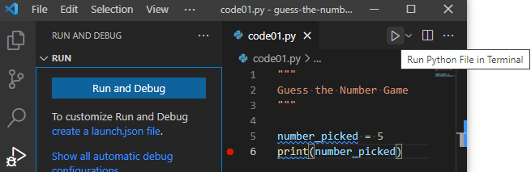
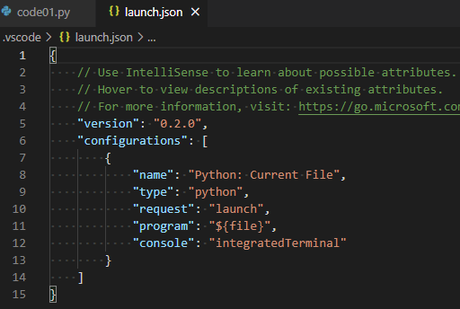
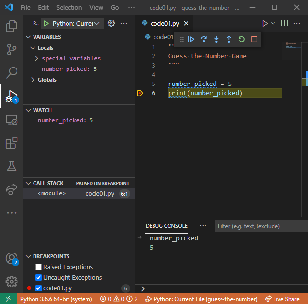

# Guess the Number: a single round edition {#guess-the-number-single-round}

The previous chapter covered Python basics, so now you are ready to start developing you first game! We will build it step by step as there will be a lot to learn about input, libraries, conditional statements, and indentation.

Before you start, create a new folder (inside your [course folder](#files-folder)) called, for example, "guess-the-number", download [exercise notebook](notebooks/Guess the number - single round.ipynb), copy it in the newly created folder, and open it in [Jupyter Notebook](#jupyter-notebooks). As in the chapter before, it will contain exercises on reading and understanding the code. 

However, we will be using [VS Code](#install-vs-code) to program scripts with the actual game. You will need to create a separate file for each code practice^[You can "Save as..." the previous code to avoid copy-pasting things by hand.] (e.g., _code01.py_^[I recommend using `01` instead of `1`, as it will ensure consistent file sorting in your file manager], _code02.py_, etc.) This is not the most efficient implementation of a version control and it will certainly clutter the folder. But it would allow me to see your solutions for every step, which will make it easier for me to give feedback. For submitting the assignment, just zip the folder and submit the zip-file.

## Chapter concepts

* [Documenting code](#documenting-your-code).
* [Debugging code](#debugging).
* Getting [input](#input-function) from a user.
* Using [comparison](#comparisons) in [conditional statements](#if-statement).
* Using [indentation](#indentation) to group statements together.
* Using Python [libraries](#using-libraries).
* Generating [random numbers](#picking-a-number-randomly).

## The Game
We will program a game in which one participant (computer) picks a number within a certain range (say, between 1 and 10) and the other participant (human player) is trying to guess it. After every guess of the human, the computer responds whether the actual number is lower than a guess, higher than a guess, or matches it. The game is over when the player correctly guesses the number or (in the later version of the game) runs out of attempts.

Our first version will allow just one attempt and the overall game algorithm will look like this:

1. computer generates a random number between 1 and 10
2. prints it out for debugging purposes
3. prompts user to enter a guess
4. compares two numbers and print outs the outcome: "My number is lower", "My number is higher", or "Spot on!"


## Let's pick a number
Let us start by implementing just the first two steps of the program. First, create a variable holding a number that computer "picked". We will name it `number_picked` (you can use some other meaningful name as well but it might be easier if we all stick to the same name). To make things simpler at the beginning, we will hard-code an arbitrary number between 1 and 10 (pick the one you like). Then, let us print it out, so that we know the number ourselves^[Of course, we know it because we hard-coded it. But that won't be the case when computer will generate it randomly, so let us plan for the future]. Use string formatting to make things user-friendly, e.g., print out something like "The number I've picked is ...". You should be able to do this using the knowledge from the previous chapter. Your code should be a two-liner:
```{python eval=FALSE}
# 1. create variable and set its value
# 2. print out the value
```

Try out this two-liner in a Jupyter Notebook (create an empty notebook just for that). Once you are happy with it, copy-paste the code into `code01.py` and read on to learn how to run it.

::: {.rmdnote .program}
Put your code into `code01.py`.
:::

## Documenting your code
Now that you have your first file with Python program, you should document it. Documenting a two-lines long and simple program may feel silly but it should be an automatic thing. Later on you will find yourself using several lines of comments to document a single line function. Again, it is not about the code that works, it is about the code you can understand. In a sense, it is better to have a clean well-documented program that currently does not work correctly than an undocumented spaghetti code that does. You can fix and update the former, but maintaining or updating the latter...

In Python, you have two ways to write comments  multiline and single line
```python
'''
A 
multiline 
comment
'''

#  A single line comment.
```

Use multiline comments to write documentation for individual files, functions, classes, methods, etc. You will learn how to format this documentation Numpy docstring style, once you learn about functions.  In our case, you should start your `code01.py` file with a multiline comment that briefly describes what program it contains. Minimally, you should write that this is a _Guess a Number_ game. It is probably a good idea to sketch out what the game is about.

Use single line comments to explain what happens in a particular code block. You do not need to comment every line and you should not explain the code in human language. A comment should be about _what_ is going on not _how_. At the moment, we have too little code to need this. 

::: {.rmdnote .program}
Document `code01.py` file.
:::

## Running and debugging your game in VS Code {#debugging}
Now that we have a two-lines-long program, we can run it and already start learning how to debug it. Yes, our current program is probably to simple to require actual debugging but it is also simple enough to make understanding debugging easier as well. And debugging is a crucial skill that turns a running program from a black box into something transparent and easy^[Or, at least, easier.] to understand. Below I will describe how to debug in VS Code but you might want to consult [an official manual](https://code.visualstudio.com/docs/python/debugging) in case things have changed in the meantime.

There are two ways to run a Python program in VS Code. First, you can use the _"Run Python File in Terminal"_ play button on the right. This runs your program _without_ a debugger, so you should use it only for the actual runs of the finalized code. Still, you can try running it and see whether it prints out what it should.



The alternative is the debugging tab, the one with a little bug on top of the run button. If you select it, it will show _"Run and Debug"_. Click on the button and it will offer various choices for different kinds of Python projects and frameworks. For our intents and purposes, we will only need _"Python File: Debug the currently active Python file"_. Click on that and it will execute your code (should run exactly the same way as with the other button).


You probably do not want to click through Debugging tab → Run and Debug button → Pick configuration all the time. A better way is to configure it once and for all and then use **F5** key to run your code. First, click on _"create a launch.json file"_ and select the _"Python File: Debug the currently active Python file"_ again. You will see a new _launch.json_ file appearing in the editor that should look like this:



That's it! VS Code created a configuration for you. Now you can close _launch.json_ file and run your program with a simple press of **F5** button. Try it! Again, it should work just like before, so why did we go through all this trouble? Because debugger will _pause_ an execution of your code whenever it encounters a problem, giving you a chance to examine variables, run snippets of code, etc. In contrast, running python file in terminal (the first option) will only print an error message and exit the program. Moreover, you can use _breakpoints_ to pause the program at any line, which gives you an opportunity to examine your code at any location that you need.

You enable breakpoints by clicking to the left of the line number that you are interested in. Here, I've clicked on line 6 and you can see a red dot that indicates an active breakpoint.


If I now run the code via **F5**, the program will stop at that line _before_ executing it.



This gives me a chance to see what value my `number_picked` variable has. It is already listed in local variables (top left). But I also added it to list of watched variables (_Watch_, lift middle) and I also looked at its value in the _Debug Console_ (bottom tab) that allows me to execute _any_ Python code while my program is paused. Do the same and explore these different ways yourself. For example, see how you can compute `number_picked + 1` or `number_picked * number_picked` in the _Watch_ tab and in _Debug Console_.

Once you are done examining the current state of the program, you have six buttons at the top to decide what to do next (hover over them to see hints). They are, from left to right

* Continue (**F5**): resume the program.
* Step Over (**F10**): executes the code without going into functions (this and two following options will become clearer once you learn about writing functions).
* Step Into the code (**F11**)
* Step Out of the code (**Shift+F11**).
* Restart the program (**Ctrl+Shift+F5**).
* Stop the program (**Shift+F5**).

To better understand how this works, stop the program (**Shift+F5**) and put an additional breakpoint on the first line of your code (line #5 in my program, the other lines are comments or are empty). Run the program again via **F5** and it will pause at that very first line. Can you figure out the value of variable `number_picked` now?

The answer is "no" because that variable does not exist yet. Remember, the program pauses _before_ executing the line. Use **F10** to step through the code line by line to see how the variable appears and the information gets printed out.

This debugging exercise may not have been necessary to solve problems with your current code but it showed how to do that in the future. Do not hesitate to put a breakpoint to pause the program and check that reality (i.e., actual values of variables) matches your expectations. Use the stepping through the code to slow things down to watch and ponder.

## Asking a player for a guess {#input-function}
It takes two to play the _Guess the Number_ game. The computer did its part by picking a number, now we need to ask a player to enter their guess. For this, we will use [input()](https://docs.python.org/3/library/functions.html#input) _function_.

A function is an isolated code that accepts (optional) _inputs_, performs an _action_, and, optionally, returns a value (_output_). This allows both to split the code into smaller chunks that are easier to maintain and to reuse the same code. You already used [print()](https://docs.python.org/3/library/functions.html#print) function to print things out, and [str()](https://docs.python.org/3/library/functions.html#func-str), [bool()](https://docs.python.org/3/library/functions.html#bool), [int()](https://docs.python.org/3/library/functions.html#int) and [float()](https://docs.python.org/3/library/functions.html#float) functions to convert values. For [print()](https://docs.python.org/3/library/functions.html#print) _input_ is an arbitrary number of values (even none, try this in Jupiter Notebook!), its _action_ is to print things out, but it returns nothing (no _output_). [float()](https://docs.python.org/3/library/functions.html#float) function takes (somewhat surprisingly) zero or one value as _input_ (try giving it none or more than one in Jupiter Notebook as see the difference), attempts to convert given value to float (throwing an error, if it cannot do it), and returns a float value as an _output_.

Similar _input_ → _action_ → _output_ scheme holds for the [input(prompt)](https://docs.python.org/3/library/functions.html#input). It takes an optional `prompt` string as input. Then it prints the `prompt` message and waits for a user to enter a _string_ until they press **Enter**. It then returns this _string_ value. The latter bit about _string_ is important, because in our game we need a player to enter an _integer_ not a string. For a moment, let us assume that the input is always a valid integer number, so type only valid integers when testing the program! This way we can convert it to an integer without extra checks (will add them in the future) and assign this value to a new variable called `guess`. Thus, you need to add a single line assignment statement with `guess` variable on the left side and call to [input()](https://docs.python.org/3/library/functions.html#input) function on the right side (think of a nice prompt message) wrapped by (inside of) the type-conversion to integer via [int()](https://docs.python.org/3/library/functions.html#int). Test this code but, again, only enter valid integers, so that the conversion works without an error.

::: {.rmdnote .program}
Update your `code01.py`.
:::

## Conditional _if_ statement {#if-statement}
Now we have two numbers: One that computer picked (`number_picked`) and one that the has player entered (`guess`). We need to compare them to provide correct output message. For this, we will use conditional [if statement](https://docs.python.org/3/tutorial/controlflow.html#if-statements):
```{python eval=FALSE}
if some_condition_is_true:
    # do something
elif some_other_condition_is_true:
    # do something else
elif yet_another_condition_is_true:
    # do yet something else
else:
    # do something only if all conditions above are false.
```

Only the `if` part is required, whereas `elif` (short for "else, if") and `else` are optional. Thus you can do something, only if a condition is true:
```{python eval=FALSE}
if some_condition_is_true:
    # do something, but OTHERWISE DO NOT DO ANYTHING 
    # and continue with code execution
  
# some code that is executed after the if-statement,
# irrespective of whether the condition was true or not.
```

Before we can use conditional statements in our game, you need to understand (1) the conditions themselves and (2) use of indentation as a mean of grouping statements together.

## Conditions and comparisons {#comparisons}
Condition is any expression that can be evaluated to see whether it is `True` or `False`. A straightforward example of such expression are comparisons expressed in human language as: _Is today Thursday?_ _Is the answer (equal to) 42?_ _Is it raining and I have an umbrella?_ We will concentrate on comparisons like that for a moment but later you will see that in Python _any_ expression is either `True` or `False`, even when it does not look like a comparison^[This is because you can convert any value to a logical one via [bool()](https://docs.python.org/3/library/functions.html#bool) function that you learned about the last time and so any value is (converted to) either `True` or `False`.].

For the comparison, you can use the following operators:

* _"A is equal B"_ is written as `A == B`.
* _"A is not equal B"_ is written as `A != B`.
* _"A is greater than B"_ and _"A is smaller than B"_ are, respectively, `A > B` and `A < B`.
* _"A is greater than or equal to B"_ and _"A is smaller than or equal to B"_ are, respectively, `A >= B` and `A <= B` (please note the order of symbols as `=>` and `=<` will produce an error).

::: {.rmdnote .practice}
Go to exercise #1 to solve some comparisons.
:::

Note that Python also has an [is](https://docs.python.org/3/library/operator.html#operator.is_) operator that may _look_ identical to `==` (e.g., `x == 2` looks equivalent to `x is 2`). Moreover, in _some_ cases it also works the same way. However, there is a subtle difference: `==` checks whether _values_ are identical, whereas `is` checks whether _objects_ (that "hold" values) are identical. You need to understand classes and objects before you can appreciate this difference, so for now just keep in mind that you should only use `==` (I will explicitly mentioned when `is` is needed).

You can _invert_ the logical value using `not` operator, as `not True` is `False` and `not False` is `True`. This means that `A != B` is the same as `not A == B` and, correspondingly, `A == B` is `not A != B`. To see how that works, consider both cases when `A` is indeed equal `B` and when it is not.

* If A is equal B then `A == B` evaluates to `True`. The `A != B` is then `False`, so `not A != B` → `not False` → `True`.
* If A is not equal B then `A == B` evaluates to `False`. The `A != B` is then `True`, so `not A != B` → `not True` → `False`.

::: {.rmdnote .practice}
Go to exercise #2 to explore this inversion yourself.
:::

You can also combine several comparisons using `and` and/or^[pun intended] `or` operators. As in human language, `and` means that both parts must be true: `True and True` → `True` but `True and False` → `False`, `False and True` → `False`, and `False and False` → `False`. Same holds if you have more have than two conditions/comparisons linked via `and`: **All** of them must be true. In case of `or` only one of the statements must be true, e.g. `True or True` → `True`, `True or False` → `True`, `False or True` → `True`, but `False or False` → `False`. Again, for more than two comparisons/conditions at least one of them should be true for the entire expression to be true.

::: {.rmdnote .practice}
Do exercises #3 and #4.
:::

Subtle but important point: conditions are evaluated from left to right until the whole expression is resolved one way or another. This means that if the first expression in a `and` pair is `False`, the second one is **never evaluated**. I.e., if `first and second` expressions both need to be `True` and you know that `first` expression already is false, the whole expression will be `False` in any case. This means that in the code below there will be no error, even though evaluating `int("e123")` alone would raise a `ValueError`.
```{python eval=FALSE}
2 * 2 == 5 and int("e123") == 123
```

However, reverse the order, so that `int("e123") == 123` needs to be evaluated first and you get the error message
```{python eval=FALSE}
int("e123") == 123 and 2 * 2 == 4
# Generates ValueError: invalid literal for int() with base 10: 'e123'
```

Similarly, if _any_ expression in `or` is `True`, you do not need to check the rest.
```{python eval=FALSE}
2 * 2 == 4 or int("e123") == 123
```

However, if the first condition is `False`, we do need to continue (and stumble into an error):
```{python eval=FALSE}
2 * 2 == 5 or int("e123") == 123
# Generates ValueError: invalid literal for int() with base 10: 'e123'
```

::: {.rmdnote .practice}
Do exercise #5.
:::

Finally, like in simple arithmetic, you can use brackets `()` to group conditions together. Thus a statement "I always eat chocolate but I eat spinach only when I am hungry" can be written as `food == "chocolate" or (food == "spinach" and hungry)`. Here, `the food == "chocolate"` and `food == "spinach" and hungry` are evaluated independently, their values are substituted in their place and then the `and` condition is evaluated. 

::: {.rmdnote .practice}
Do exercise #6.
:::

Final thought on comparisons: Do not hesitate to test them in Jupyter Notebook using various combinations of values or pause the program at the condition via a breakpoint and evaluate a comparison in _Watch_ or _Debug Console_. 

## Grouping statements via indentation {#indentation}
Let us go back to a conditional if-statement. Take a look at following code example (and note an `:` at the end of the `if some_condition_is_true:`), in which _statement #1_ is executed only if _some condition_ is true, whereas _statement #2_ is executed after that _irrespective_ of the condition.
```{python eval=FALSE}
if some_condition_is_true:
    statement #1
statement #2 
```

Both statements #1 and #2 appear after the if-statement, so how does Python now that the first one is executed only if condition is true but the other one always runs? The answer is indentation: The **4 (four!) spaces**  that are automatically added whenever you press **Tab** in VS Code and removed whenever you press **Shift+Tab**. The indentation puts statement #1 _inside_ the if-statement. Thus, indentation shows whether statements belong to the same group and must be executed one after another (same indentation level for `if` and `statement #2`) or are inside conditional statement, loop, function, class, etc. (`statement #1`). For more complex code that will have, for example, an if-statement inside an if-statement inside a loop, you will express this by adding more levels of indentation. E.g.
```{python eval=FALSE}
# some statements outside of the loop (0 indentation)
while game_is_not_over: # (0 indentation)
    # statements inside of the loop 
    if key_pressed: # (indentation of 4)
        # inside loop and if-statement 
        if key == "Space": # (indentation of 8)
            # inside the loop, and if-statement, and another if-statement
            jump() # (indentation of 12)
        else: # (indentation of 4)
            # inside the loop, and if-statement, and else part of another if-statement
            stand() # (indentation of 12)
    
    # statements inside of the loop but outside of the outermost if-statement
    print(key) # (indentation of 4)
    
# some statements outside of the loop (0 indentation)
```
Pay very close attention to the indentation as it determines which statements are executed together! A wrong indentation level is unfortunately a very common mistake.

::: {.rmdnote .practice}
Do exercise #7.
:::

The `if` and `ifelse` statements are evaluated until one of them turns out to be `True`. After that any following `ifelse` and `else` statements are simply ignored. 

::: {.rmdnote .practice}
Do exercise #8.
:::

## Checking the answer
Now you have all necessary tools to finish the first version of our game. Add a conditional statements to your `code01.py`, so that 

* if the computer pick is smaller than player's guess, it will print `"My number is lower!"`
* if the computer pick is larger than player's guess, it will print `"My number is higher!"`
* if two numbers are identical, it will print `"Spot on!"`

::: {.rmdnote .program}
Update `code01.py`
:::

Test that your code works. Again, use breakpoints if you need to better understand the control flow and check whether comparisons work the way you expect.

## Using libraries {#using-libraries}
Our game is "feature-complete": computer picks a number, player makes a guess, computer responds appropriately. However, currently we are playing for both sides. Lets make computer pick a random number itself. For this we need to use [randint(a, b)](https://docs.python.org/3/library/random.html#random.randint). It is a part of any Python distribution, so you would have it even if you would install a vanilla Python distribution instead of using one from PsychoPy. However, you cannot use it straightaway like you did with `print()` or `input()`. Type `randint(1, 3)` in your Jupyter Notebook and observe _NameError: name 'randint' is not defined_.

The reason for this is that Python has an awful lot of functions and loading them all at the same time would clog the memory with things you never intended to use. Instead, they are packaged into _libraries_, so that you can import only functions (or libraries) that you actually need for your program. You [import](https://docs.python.org/3/reference/import.html) them via an `import` statement that should go to the top of your file (but below the comment about the file content). There are several ways you can import libraries. First, you can import an _entire_ library (such as _random_ library that has function `randint()` that we need) and then use its functions as `<library>.<function>`. For `randint` this would be
```{python eval=FALSE}
import random

computer_pick = random.randint(1, 5)
```

I would suggest this as a preferred way of using libraries as it forces you to explicitly mention the name of the library when calling a function, i.e. `random.randint()` instead of just `randint()`. This may not look important with just one imported library but even in a modestly-sized project you will import many libraries, so figuring out which library the function belongs to will be tricky. Even more importantly, different libraries may have functions with _the same name_. In this case, the function you are using will come from the _last_ library you imported. But you may not realize this and this is a sort of mistake that is really hard to track down. Thus, unless you have a very good reason to do otherwise, always import the entire library and use `library.` notation!

Another and less explicit option is to import only _some_ functions and use them _without_ the `library.` prefix. You can import more than one function by listing them all
```{python eval=FALSE}
from random import randint, randrange

computer_pick = randint(1, 5)
```

You can also _rename_ a library or a function while importing it via `as`. In short, you should not do this as using a different name for a library or a function would make it harder for others (and even for future-you) to understand your code. However, there are some "standard" renaming patterns that are used universally and which you are likely to encounter.
```{python eval=FALSE}
# this is a standard way to import these two libraries
import numpy as np
import pandas as pd

np.abs(-1)

# you can rename individual functions as well, if you really have to (but, please, don't!)
from random import randint as random_integer

computer_pick = random_integer(1, 5)
```

Finally, there is a **very bad way** to import functions from a library: `from random import *`. The asterisk means that you want to import _all_ functions from the library and you want to call them by their names without `random.` prefix. Never, never, never^[Did I already say never? Never!] do this! This fills your environment with functions that you may not be aware of, potentially overwriting some other functions, creating conflicts, etc. Never ever! I am showing you this only because you will, at some point, see a code that uses this approach and you might think that this is a good idea. It is a terrible idea! Import the library, not the functions, so you can explicitly show which library you are relying on when calling a function. Always remember the [Zen of Python](https://www.python.org/dev/peps/pep-0020/): "Explicit is better than implicit."

## Picking a number randomly
Now that you know how to import a library, we can use [randint()](https://docs.python.org/3/library/random.html#random.randint) function. For this, save a copy of your original code into `code02.py`. Import the library and use [randint()](https://docs.python.org/3/library/random.html#random.randint) to generate a random number between 1 and 10. Read the documentation  on [randint()](https://docs.python.org/3/library/random.html#random.randint) to understand how to use it. Reading manuals is a necessary part of programming, so this is a good point to start practicing.


Once you implemented this in `code02.py`, run it several times to check that computer does pick different random values. Again, use breakpoints if you want to double-check what is going on.

::: {.rmdnote .program}
Put your code into `code02.py`.
:::

Congratulations, you just programmed your first computer game! Yes, it is very simple but it has key ingredients: a random decision by computer, a user input, and feedback. Next time, you will learn about loops to allow for multiple attempts and will start writing functions to make your code modular and reliable. In the meantime, let us solidify your knowledge by programming yet another game!

## One-armed bandit (a single round edition)
You know everything you need to program a simple version of an "one-armed bandit" game. Here is the game logic:

1. Import random library, so you could use `randint` function
2. Generate three random integers (say, between 1 and 5) and store them in three variables `slot1`, `slot2`, and `slot3`.
3. Print out the numbers, use string formatting to make it look nice.
4. In addition, 
    * if all three values are the same, print `"Three of a kind!"`. 
    * If only two numbers match, print `"Pair!"`. 
    * Do not print anything, if all numbers are different.

Do not forget to document the new `code03.py` file and feel free to use breakpoints to debug it.

::: {.rmdnote .program}
Put your code into `code03.py`.
:::

## Submitting for the seminar
For the seminar, submit a zipped folder with exercise notebook and all three programs.
