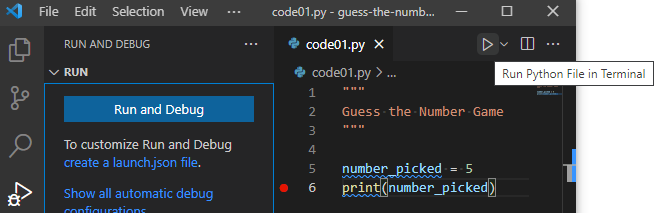
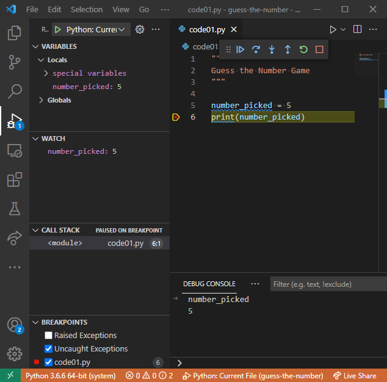

# Guess the Number {#guess-the-number}

The previous chapter covered Python basics, so now you are ready to start developing you first game! We will build it step by step as there will be a lot to learn about input, libraries, conditional statements, and indentation. The chapter is designed to require two seminars to complete.

Before you start, create a new folder (inside your [course folder](#files-folder)) called, for example, "guess-the-number", download [exercise notebook](notebooks/Seminar 02. Guess the number.ipynb), copy it in the newly created folder, and open it in [Jupyter Notebook](#jupyter-notebooks). As in the chapter before, it will contain exercises on reading and understanding the code. 

However, we will be using [VS Code](#install-vs-code) to program scripts with the actual game. You will need to create a separate file for each code practice^[You can "Save as..." the previous code to avoid copy-pasting things by hand.] (e.g., _code01.py_^[I recommend using `01` instead of `1`, as it will ensure consistent file sorting in your file manager], _code02.py_, etc.) This is not the most efficient implementation of a version control and it will certainly clutter the folder. But it would allow me to see your solutions for every step, which will make it easier for me to give feedback. For submitting the assignment, just zip the folder and submit the zip-file.

## The Game
We will program a game in which one participant (computer) picks a number within a certain range (say, between 1 and 10) and the other participant (human player) is trying to guess it. After every guess of the human, the computer responds whether the actual number is lower than a guess, higher than a guess, or matches it. The game is over when the player correctly guesses the number or (in the later version of the game) runs out of attempts.

Our first version will allow just one attempt and the overall game algorithm will look like this:

1. computer generates a random number
2. prints it out for debug purposes
3. prompts user to enter a guess
4. compares two numbers and print outs the outcome: "My number is lower", "My number is higher", or "Spot on!"


## Let's pick a number
Let us start by implementing just the first two steps of the program. First, create a variable holding a number that computer "picked". We will name it `number_picked` (you can use some other meaningful name as well but it might be easier if we all stick to the same name). To make things a simpler at the beginning, we will hard-code an arbitrary number between 1 and 10 (pick the one you like). Then, let us print it out, so that we know the number ourselves ^[Of course, we know it because we hard-coded it. But that won't be the case when computer will generate it randomly, so let us plan for the future]. Use string formatting to make things user-friendly, e.g., print out something like "The number I've picked is ...". You should be able to do this using the knowledge from the previous chapter. Your code should be a two-liner:
```{python eval=FALSE}
# 1. create variable and set its value
# 2. print out the value
```

Try out this two-liner in a Jupyter Notebook (create an empty one for that). Once you are happy with it, copy-paste the code into `code01.py` and read on to learn how to run it.

::: {.rmdnote .program}
Put your code into `code01.py`.
:::

## Commenting your code


## Running and debugging your game in VS Code {#debugging}
Now that we have a two-lines-long program, we can run it and already start learning how to debug it. Yes, our current program is probably to simple to require actual debugging but it is also simple enough to make understanding debugging easier as well. And debugging is a crucial skill that turns a running program from a black box into something transparent and easy^[Or, at least, easier.] to understand. Below I will describes how to debug in VS Code but you might want to consult [an official manual](https://code.visualstudio.com/docs/python/debugging) in case things have changed in the meantime.

There are two ways to run a Python program in VS Code. First, you can use the "Run Python File in Terminal" play button on the right. This runs your program _without_ a debugger, so you should use it only for the actual runs of the finalized code. Still, you can try running it and see whether it prints out what it should.



The alternative is the debugging tab, the one with a little bug on top of the run button. If you select it, it will offer to "Run and Debug". Click on the button and it will offer various choices that are applicable different Python-based frameworks. For our intents and purposes, we will only use "Python File: Debug the currently active Python file". Click on that and it will execute your code (should run exactly the same way as with the other button).


You probably do not want to click through Debugging tab → Run and Debug button → Pick configuration all the time. A better way is to configure it once and for all and then use **F5** key to run your code. First, click on "create a launch.json file" and select the "Python File: Debug the currently active Python file" again. You will see a new _launch.json_ file appearing in the editor that should look like this:


That's it! VS Code created a configuration for you. Now you can close it and run your program with a simple press of **F5** button. Try it! Again, it should look just like before, so why did we go through all this trouble? Because debugger will _pause_ an execution of your code whenever it encounters a problem, giving you a chance to examine variables, run snippets of code, etc. In contrast, running python file in terminal will only print an error message and exit the program. Moreover, you can use _breakpoints_ to pause the program at any line, which gives you an opportunity to examine your code at any location that you need.

You enable breakpoints by clicking to the left of the line number that you are interested in. Here, I've clicked on line 6 and you can see a red dot that indicates an active breakpoint.


If I now run the code via **F5**, the program will stop at that line _before_ executing it.



This gives me a chance to look what value my `number_picked` variable has. It is already listed in local variables (top left). But I also added it to list of watched variables (_Watch_, lift middle) and I also looked at its value in the Debug Console (bottom tab) that allows me to execute _any_ Python code while my program is paused. Do the same and explore these different ways yourself. For example, see how you can compute `number_picked + 1` in the _Watch_ tab and in _Debug Console_.

Once you are done examining the current state of the program, you have six buttons at the top (hover over them, to see the hints). They are, from left to right

* Continue (**F5**): resuming the program.
* Step Over (**F10**): executes the code with going inside the functions (this and the two following options will become clearer once you learn about functions).
* Step Into the code (**F11**)
* Step Out of the code (**Shift + F11**).
* Restart the program (**Ctrl + Shift + F5**).
* Stop the program (**Shift + F5**).

To better understand how this works, stop the program (**Shift + F5**) and put an additional breakpoint on the first line of your code (line #5 in my program, the other lines are comments or are empty). Run the program again, it will pause at that very first line. Can you figure out the value of variable `number_picked` now?


## Asking user for a guess (Exercise 2) {#input-function}
Now we need to ask the player to enter their guess. For this, we will use [input([prompt])](https://docs.python.org/3/library/functions.html#input) function (here and below the links lead to the official documentation). It prints out `prompt` (a string) if you supplied it, reads the input (key presses) until the user presses `Enter`, and returns it **as a string**. For a moment, let us assume that the input is always an valid integer number (so, type only valid integers!), so we can convert it to an integer without extra checks (will add them later) and assign this value to a new variable called `guess`. Thus, you need to write a single line assignment statement with `guess` variable on the left side, whereas on the right should be a call to the `input(...)` function (think of a nice prompt message) wrapped by the type-conversion to `int(...)`. Switch to exercise 2 and, for the moment, only enter valid integers when running the code, so that the conversion works without an error.

::: {.rmdnote .program}
Put your code into exercise #2.
:::

## Conditional _if_ statement
Now we have two numbers: One that computer picked and one that is player's guess. Now, we need to compare them to provide correct output message. For this, we will use conditional [if statement](https://docs.python.org/3/tutorial/controlflow.html#if-statements):
```{python eval=FALSE}
if some_condition_is_true:
    # do something
elif some_other_condition_is_true:
    # do something else
elif yet_another_condition_is_true:
    # do yet something else
else:
    # do something only if all conditions above are false.
```

Only the `if` part is required, whereas `elif` (short for "else, if") and `else` are optional. Thus you can do something, only if a condition is true:
```{python eval=FALSE}
if some_condition_is_true:
    # do something, but OTHERWISE DO NOT DO ANYTHING 
    # and continue with code execution
  
# some code that is executed after the if-statement,
# irrespective of whether the condition was true or not.
```

Before we can properly use conditional statements, you need to understand (1) the conditions themselves and (2) use of indentation as a mean of grouping statements together.

## Conditions and comparisons (exercises 3-8)
Condition is any expression that can be evaluated to see whether it is `True` or `False`. A straightforward example of such expression are comparisons, in human language expressed as "is today Thursday?", "is the answer equal to 42", "is it raining and I have an umbrella?". We will concentrate on them here but later you will see that in Python **any** expression is either `True` or `False`, even when it does not look like a comparison.

For the comparison, you can use the following operators:

* _"A is equal B"_ is written as `A == B`.
* _"A is not equal B"_ is written as `A != B`.
* _"A is greater than B"_ and _"A is smaller than B"_ are, respectively, `A > B` and `A < B`.
* _"A is greater than or equal to B"_ and _"A is smaller than or equal to B"_ are, respectively, `A >= B` and `A <= B` (please note the order of symbols!).

::: {.rmdnote .practice}
Go to exercise #3 to solve some comparisons.
:::

You can _invert_ the logical value using `not` operator, as `not True` is `False` and `not False` is `True`. This means that `A != B` is the same as `not A == B` and, correspondingly, `A == B` is `not A != B`. To see how that works, consider both cases when `A` is indeed equal `B` and when it is not.

* If A is equal B then `A == B` evaluates to `True`. The `A != B` is then `False`, so `not A != B` → `not False` → `True`.
* If A is not equal B then `A == B` evaluates to `False`. The `A != B` is then `True`, so `not A != B` → `not True` → `False`.

::: {.rmdnote .practice}
Go to exercise #4 to explore this inversion yourself.
:::

You can also combine several comparisons using `and` and/or `or` operators. As in human language, `and` means that both parts must be true: `True and True` → `True` but `True and False` → `False`, `False and True` → `False`, and `False and False` → `False`. Same holds if you have more have than two conditions/comparisons, **all** of them must be true. In case of `or` only one of the statements must be true, e.g. `True and True` → `True`, `True and False` → `True`, `False and True` → `True`, but `False and False` → `False`. Again, for more than two comparisons/conditions at least one of them should be true for the entire expression to be true.

::: {.rmdnote .practice}
Do exercises #5 and #6.
:::

Subtle but important point: conditions are evaluated from left to right until the whole expression can be definitely resolved. This means that if the first expression in a `and` pair is `False`, the second one is **never evaluated**. I.e., if `first and second` expressions both need to be `True` and you know that already `first` expression is false, the whole expression will be `False` in any case. This means that in the code below there will be no error, even though evaluating `int("e123")` raises `ValueError`.
```{python eval=FALSE}
2 * 2 == 5 and int("e123") == 123
```

However, reverse the order, so that `int("e123") == 123` needs to be evaluated first and you get the error message
```{python eval=FALSE}
int("e123") == 123 and 2 * 2 == 4
# Generates ValueError: invalid literal for int() with base 10: 'e123'
```

Similarly, if _any_ expression in `or` is `True`, you do not need to check the rest.
```{python eval=FALSE}
2 * 2 == 4 or int("e123") == 123
```

However, if the first condition is `False`, we do need to continue (and stumble into an error):
```{python eval=FALSE}
2 * 2 == 5 or int("e123") == 123
# Generates ValueError: invalid literal for int() with base 10: 'e123'
```

::: {.rmdnote .practice}
Do exercise #7.
:::

Finally, like in simple arithmetic, you can use brackets `()` to group conditions together. Thus a statement "I always eat chocolate but I eat spinach only when I am hungry" can be written as `food == "chocolate" or (food == "spinach" and hungry)`. Here, `the food == "chocolate"` and `food == "spinach" and hungry` are evaluated independently, their values are substituted in their place and then the `and` condition is evaluated. 

::: {.rmdnote .practice}
Do exercise #8.
:::

## Grouping statements via identation (exercise #9)
Let us go back to the conditional if-statement. Take a look at following code example, in which statement #1 is executed only if some condition is true, whereas statement #2 is executed after that irrespective of the condition.
```{python eval=FALSE}
if some_condition_is_true:
    statement #1
statement #2 
```

Both statements #1 and #2 appear after the if-statement, so how does Python now that the first one is executed only if condition is true but the other one always runs? The answer is indentation (the **4 (four!)** spaces, they are automatically added whenever you press `Tab` and removed whenever you press `Shift + Tab`) that puts statement #1 _inside_ the if-statement. Thus, indentation shows whether statements belong to the same group (same indentation as for `if` and `statement #2`) or are inside conditional statement, loop, or function (`statement #1`). For more complex code that will have, for example, if-statement inside an if-statement inside a loop, you will express this by adding more levels of indentation. E.g.
```{python eval=FALSE}
# some statements outside of the loop (0 indentation)
while game_is_not_over: # (0 indentation)
    # statements inside of the loop 
    if key_pressed: # (indentation of 4)
        # inside loop and if-statement 
        if key == "Space": # (indentation of 8)
            # inside the loop, and if-statement, and another if-statement
            jump() # (indentation of 12)
        else: # (indentation of 4)
            # inside the loop, and if-statement, and else part of another if-statement
            stand() # (indentation of 12)
    
    # statements inside of the loop but outside of the outermost if-statement
    print(key) # (indentation of 4)
    
# some statements outside of the loop (0 indentation)
```
Pay very close attention to the indentation as it determines which statements are executed together! 

::: {.rmdnote .practice}
Do exercise #9.
:::

The `if` and `ifelse` statements are evaluated until one of them turns out to be `True`. After that any following `ifelse` and `else` statements are simply ignored. 

::: {.rmdnote .practice}
Do exercise #10.
:::

## Checking the answer (Exercise 11)
Now you have all necessary instruments to finish the first version of our game. Go to exercise #11 and, first, copy-paste your solutions to exercise #1 (settings computer pick and printing it out) and #2 (getting player input as an integer). Now, add  conditional statements below, so that 

* if the computer pick is smaller than player's guess, it will print `"My number is lower!"`
* if the computer pick is larger than player's guess, it will print `"My number is higher!"`
* if two numbers are identical, it will print `"Spot on!"`

::: {.rmdnote .program}
Put your code into exercise #11.
:::


## Picking number randomly (Exercise 12)
Our game is "feature-complete": computer picks a number, player makes a guess, computer responds appropriately. However, currently we are playing for both sides, as we hand pick the number for computer. Now, we will let computer pick this number itself using [randint(a, b)](https://docs.python.org/3/library/random.html#random.randint) function. It is part of the [random](https://docs.python.org/3/library/random.html) library, so you will need to _import_ it first. We will talk about libraries and importing them in greater detail later. For now, it suffices that the top line of your code is 
```{python eval=FALSE}
from random import randint
```
Function `randint(a, b)` generates a random integer on the interval `a..b`. In our case, this interval is `1..10`. Go to exercise #11. First copy-paste your solution for exercise #12. Add the `from random import randint` as the first line. Then, replace the hard-coded value you used for computer's pick with a call to `randint()` function. Run the code several times to check that computer does pick different random values.

::: {.rmdnote .program}
Put your code into exercise #12.
:::


Congratulations, you just programmed your first computer game! Yes, it is very simple but it has key ingredients: a random decision by computer, user input, and feedback. Next time, you will learn about loops to allow for multiple attempts and about functions to make your code modular and reliable. In the meantime, let us solidify your knowledge by programming yet another game!

## One-armed bandit (Exercise 13)
You know everything you need to program a simple version of an "one-armed bandit" game (exercise #13). Here is the game logic:

1. `from random import randint`
2. Generate three random integers (say, between 1 and 5) and store them in three variables `slot1`, `slot2`, and `slot3`.
3. Print out the numbers, use string formatting to make it look nice.
4. In addition, 
    * if all three values are the same, print `"Three of a kind!"`. 
    * If only two numbers match, print `"Pair!"`. 
    * Print nothing, if all numbers are different.

::: {.rmdnote .program}
Put your code into exercise #13.
:::
