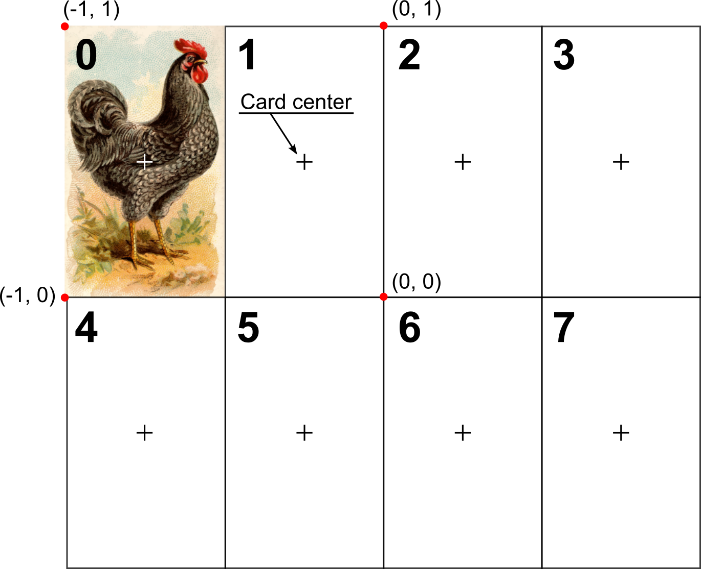

# Memory game

Today, you will write a good old _Memory_ game: Eight cards are lying "face down", you can turn any two of them and, if they are identical, they are taken off the table. If they are different, the cards turn "face down" again.

::: {.rmdnote .program}
GAMEVIDEO IS MISSING!
:::


Before we start, create a new folder for the game and create a subfolder _Images_ in it. Then, download [images of chicken](material/chicken.zip)^[The images are courtesy of [Kevin David Pointon](https://openclipart.org/artist/Firkin) and were downloaded
from [OpenClipart](https://openclipart.org/). They are [public domain](https://creativecommons.org/publicdomain/zero/1.0/) and can be used and distributed freely.] that we will use for the game and unzip them into _Images_ subfolder.

## Chapter concepts

* Mutable vs. immutable objects
* Showing [images](#imagestim).
* Working with files via [os](#os-library) library.
* Using [dictionaries](##dictionaries).
* [List operations](#list-operations).
* Looping over both index and item via list [enumeration](#enumerate).

## Variables as Boxes (immutable objects)
When you work on this game, you will eventually need to use a function that contradicts what I told you about [variable scopes](#scopes-for-immutable-values): It will _modify_ a variable (global scope) that you passed as a parameter (local function scope). This is because Python has two kinds of objects (values) and which behave very differently under some circumstances.

You may remember the _variable-as-a-box_ metaphor  I used to [introduce variables](#variables). Just to remind you, a variable can be thought of as a "box" with a variable name written on it and a value being stored "inside". When you use this value or assign it to a different variable, you can assume that Python _makes a copy_ of it^[not really, but this makes it easier to understand] and puts that _copy_ into a different variable "box". When you _replace_ value of a variable, what happens is that you take out the old value, destroy it (by throwing it into a nearest black hole, I assume), create a new one, and put it into the variable "box". When you _change_ the value of a variable based on its current state, the same thing happens. You take out the value, create a new value (by adding to the original one or doing some other operation), destroy the old one, and put it back into the variable "box".

This metaphor works nicely and explains why the [scopes](#scopes-for-immutable-values) work the way they do. Each scope has its own set of boxes and whenever you pass information between the scopes, e.g., from a global script to a function, a copy of value (from a variable) is created and put into a new box (i.e., parameter) inside the function. When the function returns the value, that is copied and put in one of the boxes in the global script, etc.

However, this is true only for _immutable_ objects (values) such as numbers, strings, logical values, etc. but also [tuples](https://docs.python.org/3/library/stdtypes.html?highlight=tuple#tuple) (see below for what these are). As you could have guessed from the name, this means that there are other _mutable_ objects and they behave very differently.

## Variables as post-it stickers (mutable objects){#mutable-objects}
Mutable objects are lists, dictionaries^[Coming up shortly!], and classes. The difference is that _immutable_ objects can be thought as fixed in their size. A number takes up that many bytes to store, same goes for a given string (although a different string would require more or fewer bytes). Still, they do not change, they are created and destroyed when unneeded but never truly updated. 

_Mutable_ objects can be changed. For example, you can add elements to your list, or remove them, or shuffle them. Same goes for [dictionaries](https://docs.python.org/3/tutorial/datastructures.html?highlight=dictionary#dictionaries). Making such object **immutable** would be computationally inefficient: Every time you add a value a long list is destroyed and recreated with just that one additional value. Which is why Python simply _updates_ the original object. For further computation efficiency, these objects are not copied but _passed by reference_. This means that the variable is no longer a "box" but a "sticker" you put on an object (a list, a dictionary). And you can put as many stickers on an object as you want **and it still will be the same object!**

What on Earth do I mean? Keeping in mind that a variable is just (one of many) stickers for a mutable object, try figuring out what will be the output below:

```python
x = [1, 2, 3]
y = x
y.append(4)
print(x)
```

::: {.infobox .practice}
Do exercise #1.
:::

What? Why? That is precisely what I have meant with "stickers on the same object". First, we create a list and put `x` sticker on it. Then, we assign `y` _to the same list_, in other words, we put a `y` sticker on the same list. Since both `x` and `y` are stickers on the _same_ object, they are, effectively, synonyms. In that specific situation, once you set `x = y`, it does not matter which variable name you use to change _the_ object, they are just two stickers hanging side-by-side on the _same_ list. Again, just a reminder, this is **not** what would happen for **immutable** values, like numbers, where things would behaved the way you expect them to behave.

This variable-as-a-sticker, a.k.a. "passing value by reference", has very important implications for the function calls, as it breaks your scope without ever giving you a warning. Look at the code below and try figuring out what the output will be.

```python 
def change_it(y):
    y.append(4)

x = [1, 2, 3]
change_it(x)
print(x)
```
::: {.infobox .practice}
Do exercise #2.
:::

How did we manage to modify a _global_ variable from inside the function? Didn't we change the _local_ parameter of the function? Yep, that is exactly the problem with passing by reference. Your function parameter is yet another sticker on the _same_ object, so even though it _looks_ like you do not need to worry about global variables (that's why you wrote the function and learned about scopes!), you still do. If you are perplexed by this, you are in a good company. This is one of the most unexpected and confusing bits in Python that routinely catches people by surprise. Let us do a few more exercises, before I show you how to solve the scope problem for the mutable objects.

::: {.infobox .practice}
Do exercise #3.
:::

## Tuple: a frozen list (#tuple)
The wise people who created Python were acutely aware of the problem that the _variable-as-a-sticker_ creates. Which is why, they added an **immutable** version of a list, called a [tuple](https://docs.python.org/3/library/stdtypes.html?highlight=tuple#tuple). It is a "frozen" list of values, which you can loop over, access its items by index, or figure out how many items it has, but you _cannot modify it_. No appending, removing, replacing values, etc. For you this means that a frozen list is a box rather than a sticker and that it behaves just like any other "normal" **immutable** object. You can create a `tuple` by using round brackets.
```python
i_am_a_tuple = (1, 2, 3)
```
You can loop over it, _e.g._
```{python}
i_am_a_tuple = (1, 2, 3)
for number in i_am_a_tuple:
    print(number)
```

but, as I said, appending will throw a mistake (try this code in a cell)
```python
i_am_a_tuple = (1, 2, 3)

# throws AttributeError: 'tuple' object has no attribute 'append'
i_am_a_tuple.append(4)
```

Same goes for trying to change it
```python
i_am_a_tuple = (1, 2, 3)

# throws TypeError: 'tuple' object does not support item assignment
i_am_a_tuple[1] = 1 
```

This means that when you need to pass a list of values to a function, you should instead pass _a tuple of values_ to the function. The function still has a list of values but the link to the original list object is now broken. You can turn a list into a tuple using `tuple()`. Keeping in mind that `tuple()` creates a frozen copy of the list, what will happen below?
```python
x = [1, 2, 3]
y = tuple(x)
x.append(4)
print(y)
```
::: {.infobox .practice}
Do exercise #4.
:::

As you probably figured out, when `y = tuple(x)`, Python creates **a copy** of the list values, freezes them (they are immutable now), and puts them into the "y" box. Hence, whatever you do to the original list, has no effect on the immutable "y".

Conversely, you "unfreeze" a tuple by turning it into a list via `list()`. Please note that it creates **a new list**, which has no relation to any other existing list, even if values  were originally taken from any of them!

::: {.infobox .practice}
Do exercise #5.
:::

Remember I just said that `list()` creates a new list? This means that you can use it to create a copy of a list directly, without an intermediate tuple step. You can also achieve the same results by slicing an entire list, e.g. `list(x)`, is the same as `x[:]`.

::: {.infobox .practice}
Do exercise #6.
:::

Here, `y = list(x)` created a new list (which was a carbon copy of the one with the "x" sticker on it) and the "y" sticker was put on that new list, while the "x" remained hanging on the original.

Confusing? You bet! If you feel overwhelmed by this whole mutable/immutable, tuple/list, copy/reference confusion, you are just being a normal human being. I understand the (computational) reasons for doing things this way and I am aware of this difference but it still catches me by surprise from time to time!

## Minimal code
Let us get busy writing the game. As usual, let us start with a minimal code (try doing it from scratch instead of copy-pasting from the last game):
```python
importing psychopy modules that we need
 
creating a window of a useful size and useful units

waiting for a key press

closing the window
```

The first thing you need to decide on here, is the window size and which units would be make sizing and placing cards easier. Each chicken image is 240×400 pixels and, for the game, we need place for _exactly_ 4×2 images, i.e. our window must be 4 cards wide and 2 cards high. 

::: {.rmdnote .program}
Put your code into _code01.py_.
:::

Do not forget to document the file!

## Drawing an image{#imagestim}
We used (boring and abstract) circles to represent moles but today we will use images (see instructions above on downloading them). Using an [image stimulus](https://psychopy.org/api/visual/imagestim.html) in PsychoPy is very straightforward because it behaves very similarly to other visual stimuli you already know. First, you need to create an new object by calling `visual.ImageStim(...)`. You can find the complete list of parameters in the [documentation]((https://psychopy.org/api/visual/imagestim.html)) but for our initial intents and purposes, we only need to pass three of them:

* our window variable: `win`.
* image file name:  `image = "Images/r01.png"` (images are in a subfolder and therefore we use a relative path).
* size: `size=(???, ???)`. That is one for you to compute. If you picked [norm](#psychopy-units-norm) units, as I did, then window is 2 units wide and 2 units high but for [height](#psychopy-units-height) it is 1 units height and _aspect-ratio_ units wide. We want to have a 4×2 images, what is the size of each image in the units of your choice?

Draw chicken (it should appear at the center of the screen).

::: {.rmdnote .program}
Put your code into _code02.py_.
:::

### Using _os_ library{#os-library}
We specified image file name as `"Images/r01.png"`. This did the job but, unfortunately, major operating systems disagree with Windows on where `/` (forward slash) or `\` (backslash) should be used. To make your code more robust, you need to construct a filename string using [os](https://docs.python.org/3/library/os.html) library. It contains various utilities for working with your operating system and, in particular, with files and directories. The function we will need for this task is [join](https://docs.python.org/3/library/os.path.html#os.path.join) in [path](https://docs.python.org/3/library/os.path.html) submodule. Thus, you can import _os_ library and call it as `os.path.join(...)` (my personal preference). Or, you can use the same approach as for PsychoPy modules and import `path` from _os_, shortening the code. Or, of course, you can even import _join_ directly but I find that lack of library information during use makes things harder to understand (even though the code is even shorter).

[join](https://docs.python.org/3/library/os.path.html#os.path.join) takes path components as parameters and joins them to match the OS format. E.g., `os.path.join("Python seminar", "Memory game", "memory01.py")` on Windows will return `'Python seminar\\Memory game\\memory01.py'`. We will need to load multiple files later on, so the _filename_ part will vary. However, the _folder_ where the images are located will be the same and, as per usual, it would a good idea to turn this constant into a formally declared [CONSTANT](#constants).

Modify your code using the image folder constant and [os.path.join()](https://docs.python.org/3/library/os.path.html#os.path.join) function.

::: {.rmdnote .program}
Put your code into _code03.py_.
:::

## Placing an image (index to position)
By default, our image is placed at the center of the screen, which is a surprisingly useful default for a typical psychophysical experiment that shows stimuli at fixation (which is also, typically, at the center of the screen). However, we will need to draw eight images, each at its designated location. You need to create a function that takes an image index (it goes 0 to 7) and returns a list with pair of values with its location on the screen. Below is a sketch of how index correspond to the location. Note that image location ([pos](https://psychopy.org/api/visual/imagestim.html#psychopy.visual.ImageStim.pos attribute) corresponds to the _center_ of the image.

{ width=100% }

Name the function `position_from_index`. It should take one argument (`index`) and return a list with `(<x>, <y>)` coordinates in the PsychoPy units (from now on I assume that these are [norm](#psychopy-units-norm)). You can then use this value for the [pos](https://psychopy.org/api/visual/imagestim.html#psychopy.visual.ImageStim.pos) argument of the [ImageStim()](https://psychopy.org/api/visual/imagestim.html#imagestim).

The computation might look complicated, so let me get you started. How could you could _x_ coordinate for the _top_ row? Concentrating on the top two alone makes things simpler because here _column index_ is the same as the overall index: the left-most column is 0, the next one is 1, etc. You need a simple algebra of $x = a_x + b_x \cdot column$. You can easily deduce out both $a_x$ and $b_x$ if you figure out locations of the first and second cards by hand. Same goes for the _y_ coordinate. Assuming that you know the _row_, which is either 0 (top row) or 1 (bottom row), you can compute $y = a_y + b_y \cdot row$.

But, I hear you say, you do not have row and column indexes, only the overall index! To compute those you only need to keep in mind that each row has _four_ cards. Then, you can make use of two special division operators: [floor division operator `//`](https://python-reference.readthedocs.io/en/latest/docs/operators/floor_division.html) and [modulos, divison remainder `%`](https://python-reference.readthedocs.io/en/latest/docs/operators/modulus.html) operators. The former returns only the integer part of the division, so that `4 // 3` is `1` (because 4/3 is 1.33333) and `1 // 4` is `0` (because 1/4 is 0.25). The latter returns the remaining integers, so that `4 % 3` is `1` and `1 % 4` is `0`.

My suggestion would be first to play with individual formulas in Jupyter Notebook that makes it easier to try out dividing things and seeing the result, putting various values into formulas, etc. Once you are confident that the code is working, turn it into function, document it, and put in a separate file (_utilities.py_, do not forget to put a comment at the top of the file as well!). You can then import it in the main script and use it to place the card. Try out different indexes and make sure that the card appears where it should. Remember, put a breakpoint and step through the program while watching variables, if things do not work as you expect.

::: {.rmdnote .program}
Put `position_from_index` into `utilities.py`.<br/>
Put update code into `code04.py`
:::

## Backside of the card
A chicken image is the _face_ but the game starts with the cards face down, so the player should see their backs. We will use a plain [rectangle](https://psychopy.org/api/visual/rect.html) for a plane backside. Pick a nice looking combination of `fillColor` (inside) and `lineColor` (contour) colors. Modify your code, to draw image (face of the card) and rectangle (back of the card) side-by-side (_e.g._, if face is at position with index 0, rectangle should be at position 1 or 4). This way you can check that sizes match and that they are positioned correctly.

::: {.rmdnote .program}
Put your code into _code05.py_.
:::

## Dictionaries {#dictionaries}
Each card that we use has plenty of properties: A front (image), a backside (rectangle), associated index, and will have other properties such which side should be shown, whether card is already taken off the screen, etc. This calls for container, so we could put all these relevant bits into a single variable. We _could_ put into a list and use numerical indexes to access individual elements (e.g., `card[0]` would be front but `card[2]` would its numerical index) but indexes do not have meaning per se, so figuring out how `card[0]` is different from `card[2]` would be tricky. Python has a solution for cases like this: [dictionaries](https://docs.python.org/3/library/stdtypes.html#dict).

A dictionary is a container that stores information using _key_-_value_ pairs. This is similar to how you look up a meaning or translation (value) of the word (key) in a real dictionary, hence the name. To create a dictionary, you use _curly_ brackets `{<key1> : <value1>}, {<key2> : <value2>, ...}` or create it via `dict(<key1>=<value1>, <key2>=<value2>, ...)`.
```python
book = {"Author" : "Walter Moers",
        "Title": "Die 13½ Leben des Käpt'n Blaubär"}
```
Once you created a dictionary, you can access or modify each field using its key, _e.g._ `print(book["Author"])` or `book["Author"] = "Moers, W."`. You can also add new fields by assigning values to them, _e.g._ `book["Publication year"] = 1999`. In short, you can use a combination of `<dictionary-variable>[<key>]` just like you would use a normal variable. This is similar to using the `list[index]` combination, the only difference is that `index` must be an integer, whereas `key` can be any hashable^[Non-[hashable](https://docs.python.org/3/glossary.html#term-hashable) objects are other dictionaries, lists, etc. These are mutable object that can _change_ while the program is running and therefore are unusable as a key (it is hard to match by a key, if the key can be different by the time you need the dictionary).] value.

## Using a dictionary to represent a card
Our card has the following properties, so these will be key-value entries in a dictionary

1. `"front"`: front side (image of a chicken).
2. `"back"`: back side (rectangle).
3. `"filename"`: identity on the card that we will use later to check whether the player opened two identical cards (their filenames match) or two different ones.
4. `"side"`: can be either `"front"` or `"back"`, information about which side is up (drawn on the screen).

Create a dictionary variable (name it `card`) and fill it with the relevant values (use either `"front"` and "`back"` for `"side"` key) and stimuli (you can put PsychoPy stimuli into a dictionary just like we put them into a list earlier). Modify you code so that it draws the correct image based on the value of the `"side"` entry. Note that you **do not need an if-statement for this**! Think about a key you need to access these two sides and the value that you have in for the `"side"` key.

::: {.rmdnote .program}
Put your code into `code06.py`.
:::

## Card factory
You have the code to create one card but we need eight of them. This definitely calls for a function. Write a function (put it into `utilities.py` to declutter the main file) that takes three parameters

1. a window variable (you need it to create PsychoPy stimuli), 
2. a filename,
3. card position index,

and returns a dictionary, just like the one you created. You very much have the code, you only need to wrap it into a function and document it. Call function `create_card` and use it in the main script to create `card` dictionary. Note that now you need the `IMAGE_FOLDER` variable in _utilities.py_, rather than in the main file (because this is where you loading them). Also, think about libraries you will now need import in _utilities.py_.

::: {.rmdnote .program}
Put `create_card` into `utilities.py`. <br/>
Put code into `code07.py`.
:::

## Getting a list of files
For a single card, we simply hard-coded the name of an image file, as well as its location. However, for a real game (or an experiment) we would like to be more flexible and automatically determine which files we have in the _Images_ folder. For this, you need to use [os.listdir(path=".")](https://docs.python.org/3/library/os.html#os.listdir) function that, you've guess it, returns a list with filenames of _all_ the files in a folder specified by path. By default, it is a current path (`path="."`). However, you can use either a relative path - `os.listdir("Images")`, assuming that _Images_ is a subfolder in your current directory - or an absolute path `os.listdir("E:/Teaching/Python/MemoryGame/Images")` (in my case)^[Use absolute path only if it is the only option, as it will almost certainly will break your code on another machine.]. 

Try this out in a Jupyter Notebook (do not forget to import the [os](https://docs.python.org/3/library/os.html#module-os) library). You should have gotten a list of 8 files that are coded as _[r|l][index].png_, where _r_ or _l_ denote a direction the chicken is looking. However, for our game we need only four images (4 × 2 = 8 cards). Therefore, we need to select a subset of them, e.g., four random cards, chicken looking to the left or to the right only. Here, let us work with chicken looking to the left, meaning that we need to pick only files that start with "l". To make this filtering easier, we will use a cool Python trick called [list comprehensions](https://docs.python.org/3/tutorial/datastructures.html#list-comprehensions).

## List comprehension
List comprehension provides an elegant and easy-to-read way to create, modify and/or filter elements of the list creating a new list. The general structure is
```python
new_list = [<transform-the-item> for item in old_list if <condition-given-the-item>]
```
Let us look at examples to understand how it works. Imagine that you have a list `numbers = [1, 2, 3]` and you need increment each number by 1^[A very arbitrary example!]. You can do it by creating a new list and adding 1 to each item in the <transform-the-item> part:

```python
numbers = [1, 2, 3]
numbers_plus_1 = [item + 1 for item in numbers]
```

Note that this is equivalent to
```python
numbers = [1, 2, 3]
numbers_plus_1 = []
for item in numbers:
    numbers_plus_1.append(item + 1)
```

Or, imagine that you need to convert each item to a string. You can do it simply as
```python
numbers = [1, 2, 3]
numbers_as_strings = [str(item) for item in numbers]
```
What would be an equivalent form using a normal for loop? Write both versions of code in Jupiter cells and check that the results are the same.

::: {.rmdnote .practice}
Do exercise #1 in Jupyter notebook.
:::

Now, implement the code below using list comprehension. Check that results match.
```python
strings = ['1', '2', '3']
numbers = []
for astring in strings:
    numbers.append(int(astring) + 10)
```

::: {.rmdnote .practice}
Do exercise #2 in Jupyter notebook.
:::

As noted above, you can also use a conditional statement to filter which items are passed to the new list. In our numbers example, we can retain numbers that are greater than 1
```python
numbers = [1, 2, 3]
numbers_greater_than_1 = [item for item in numbers if item > 1]
```

Sometimes, the same statement is written in three lines, instead of one, to make reading easier:
```python
numbers = [1, 2, 3]
numbers_greater_than_1 = [item 
                          for item in numbers
                          if item > 1]
```

You can of course combine the transformation and filtering in a single statement. Create code that filters out all items below 2 and adds 4 to them.

::: {.rmdnote .practice}
Do exercise #3 in Jupyter notebook.
:::

## Getting list of relevant files
Use list comprehensions to create a list of files of chicken looking left, _i.e._ with filenames that start with "l". Use [<your-string>.startswith()](https://docs.python.org/3/library/stdtypes.html#str.startswith) to check whether it starts with "l", store the list in `filenames` variable. Test you code in a Jupyter Notebook. You should get a list of four files.

### List operations {#list-operations}
Our list consists of four unique filenames but in the game each card should appear twice. There are several ways of duplicating lists. Here, We will use this as a opportunity to learn about list operations. Python lists implement two operations:

* Adding two lists together: `<list1> + <list2>`.
```{python}
a = [1, 2, 3]
b = [4, 5, 6]
a + b
```

Note that this produces a _new_ list and, therefore, that this is not equivalent to [extend](https://docs.python.org/3/tutorial/datastructures.html#more-on-lists) method `a.extend(b)`! The `+` creates a _new_ list, `.extend()` extends the original list `a`.^[You will learn about practical implications of this later. For now, keep in mind that seemingly identical output might be fundamentally different underneath.]

* List replication:: `<list> * <integer-value>` creates a _new_ list by replicating the original one `<integer-value>` times. For example: 
```{python}
a = [1, 2, 3]
b = 4
a * b
```

Use either operation or `.extend()` method to create the list where each filename is repeated twice. Hint, you can apply list multiplication directly to the filenames list you created via list comprehension (so, replicate it in that same line). Try this code out in a Jupyter Notebook.

## Looping over both index and item via  list enumeration  {#enumerate}
Now that we have a list of filenames, we can create a list of cards out of it. Our dictionary function requires both index and filename. The latter is the _item_ of the list, the former is the _index_ of that item. You could for a for loop by build the index using [range()](#range) function but Python has a better solution for this: a [enumerate()](https://docs.python.org/3/library/functions.html#enumerate) function! If, instead of iterating over a list, you iterate over [enumerate(<list>)](https://docs.python.org/3/library/functions.html#enumerate), you get a tuple^[A list you cannot change, more on this later.] with both `(index, value)`. Here is an example:
```{python}
letters = ['a', 'b', 'c']
for index, letter in enumerate(letters):
    print('%d: %s'%(index, letter))
```

And here is how you can use [enumerate()](https://docs.python.org/3/library/functions.html#enumerate) for list comprehension.
```{python}
letters = ['a', 'b', 'c']
["%d: %s"%(index, letter) for index, letter in enumerate(letters)]
```

## A deck of cards
Copy the code for building a duplicated list of filenames that you tested in Jupyter notebook to your main script (that'll be `code08.py`). Then, use enumerate and list comprehension over enumerated duplicate filenames ()  to create `cards` (plural, replacing your singular `card` variable) via `create_card` function you wrote earlier. Update your to loop over and draw all cards. If your default is `"side"` is `"back"`, things will look pretty boring. Change that to '"front"` to see the cards' faces.

::: {.rmdnote .program}
Put your code into `code08.py`.
:::

# Shuffling cards {#shuffle}
When you draw cards faces, you will notice that duplicating filenames list produces a very orderly sequence that makes the game easy. We need to [shuffle()](https://docs.python.org/3/library/random.html#random.shuffle) the filename list _before_ we creates `cards`. Note that [shuffle()](https://docs.python.org/3/library/random.html#random.shuffle) shuffles list item _in place_. That means you simply call the function and pass the list as an argument. The list gets modified, nothing is returned and nothing need to be assigned back of `filenames` variable.

::: {.rmdnote .program}
Put your code into `code09.py`.
:::


---

### Adding main game loop
In our game, the player will click on a card to "turn it around". We will implement a mouse interaction shortly but, first, modify the code to have the main presentation loop as we did in [PsychoPy](#psychopy-basics) seminarm i.e., a loop that repeats while games is not over. In the loop, you should draw the card (based on its `"side"`) and exit the loop if a player pressed **escape** ([getKeys](https://psychopy.org/api/event.html#psychopy.event.getKeys)).

::: {.rmdnote .program}
Put your code into `code08.py`.
:::

### Detecting a mouse click {#psychopy-mouse}
Before you can use a [mouse](https://psychopy.org/api/event.html#psychopy.event.Mouse) in PsychoPy, you must create it via `mouse = event.Mouse(visible=True, win=win)` call, where `win` is the PsychoPy window you already created. This code should appear immediately below the line where you create the window itself.

Now, you can check whether the left button was pressed using [mouse.getPressed()](https://psychopy.org/api/event.html#psychopy.event.Mouse.getPressed) method. It returns a three-item list with `True`/`False` values indicating whether each of the three buttons are _currently being pressed_. Use it the main loop, so that if the player pressed _left_ button (its index in the returned list is `0`), you change `card["side"]` to `"front"` (this assumes that you initialize the card with its `"back"` shown).

If you run the code and click _anywhere_, this should flip the card.

::: {.rmdnote .program}
Put your code into `code09.py`.
:::

## Position to index
Currently, the card is flipped if you click _anywhere_. But it should flip only when the player clicked on that specific card. For this we need to implement a function `index_from_position` that is an inverse of `position_from_index`. It should take an argument `pos`, which is a list of `(<x>, <y>)` values (that would be a mouse position within the window), and return an _integer card index_. You have float values (with decimal points) in the `pos` argument (because it ranges from -1 to 1 for [norm](#psychopy-units-norm) units) and by default the values you compute from them will also be float. However, the index is integer, so you will need to wrap it in [int()](https://docs.python.org/3/library/functions.html#int) function call, before returning it.

I think going backwards --- from position to index --- is easier. First, you need to think how you can convert x coordinate (goes from -1 to 1) to a column index (goes from 0 to 3) given that you have 4 columns. Similarly, you translate y (from -1 to 1) into raw index given that there are only two rows. Once you know row and column index, you can compute the index itself (keeping in mind that there are four card in a row). As with `position_from_index`, if think it is easier to first play with formulas in a Jupyter Notebook, before turning the code into a function, documenting it, and putting it into `utilities.py`.

::: {.infobox .program}
Put `index_from_position` into `utilities.py`.
:::

## Flip on click
Now that you have function that returns an index from position (don't forget to import it), you can check whether the player did click on the card itself. For this, you need to extend the card-flipping code inside the _if left-mouse button was pressed_ code.

You can get the position of the mouse within the window by calling [mouse.getPos()](https://psychopy.org/api/event.html#psychopy.event.Mouse.getPos). This will return a pair of `(x, y)` values, which you can pass to your `index_from_position()` function. This, in turn will return the index of the card the player click on. If it _matches_ the index of your only card (stored in `"index"` field of the `card` dictionary), then and only then you flip the card.

::: {.infobox .program}
Put your code into _exercise10.py_.
:::
