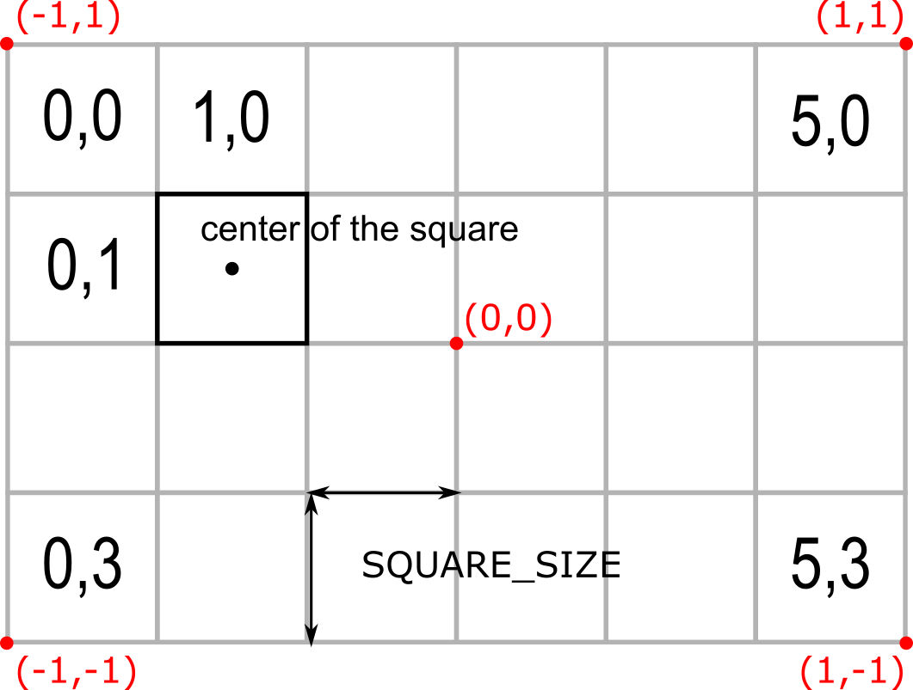
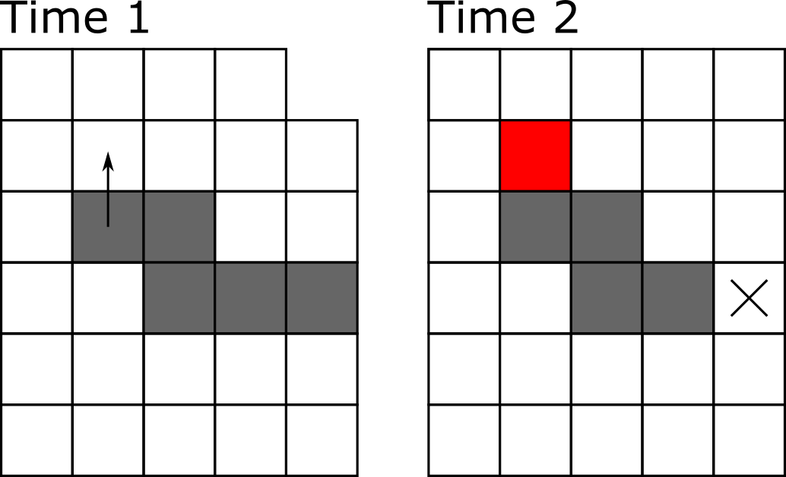

# The Snake

This chapter marks the beginning of the second semester in the course, therefore we will use our first game to refresh your knowledge of Python acquired previously. We will use classes (and their instances, objects), lists, conditional statements, loops, and external setting files to program a classic game of Snake. Consults previous chapters for any information you need to complete the game.

## Snake game: an overview

Today, we will program a good old classic: the snake game! The story is simple: you control a snake trying to eat as many apples as you can. Every time you consume an apple, snake's length increases. However, if you hit the wall or bite yourself, the game is over (or you lose one of your lives and game is over once you run out of lives).

Here is how the final product will look like.

```{r, eval=knitr::is_html_output(excludes = "epub"), results = 'asis', echo = F}
cat(
'<div style="text-align:center;"><video controls>
    <source src="videos/snake.m4v" type="video/mp4"> 
  </video></div>'
)
```

As before, we will program the game step by step, starting with an empty gray PsychoPy window. Here is the general outline of how we will proceed:

1. Create boilerplate code to initialize PsychoPy.
2. Figure out how to place a square. We need this because our snake is made of square segments and lives on a rectangular grid made of squares.
3. Create a single segment stationary snake^[Not very exciting, I know. But one has to start somewhere!].
4. Make the snake move assuming a rectangular grid. 
5. Implement "died by hitting a wall".
6. Add apples.
7, Make the snake grow when it eats an apple.
7. Add check for biting itself (and dying).
8. Add bells-and-whistles to make game look awesome.

As you can see, each new step builds on the previous one. Because of that do not proceed to the next step until the current one works and you fully(!) understand what each line of code does. Any leftover uncertainty will linger, grow and complicate your life disproportionately!

## Minimal boilerplate

We need the [usual boilerplate](#psychopy-basics) code to get us going:
* Create a PsychoPy window (hardcode its size, as we will compute it from settings later on).
* Wait for any key press.
* Close the window.

::: {.rmdnote .program}
Put your code into _code01.py_.
:::

Do not forget to put the multiline comment at the top of the file, describing what we will be doing.

## Fancy boilerplate
In the game, our snake will be composed of square segments and move on a grid made out of squares. Thus, it would be much easier to define our window size based on the size of the grid (in squares) and that of individual squares (in pixels). This way we can figure out window's height as $$window~height = window~height~[in~squares] * square~size~[in~pixels]$$. Note that the latter parameter determines how the game looks, double the size of the square in pixels and that will double both width and height of the window.

Now, let us think about the _units_ that we will use in our game. Recall that PsychoPy has [five different units](#psychopy-units) for size and position. So, which units should we pick to make it easier to draw squares? Reread section on [units](#psychopy-units) and think which units you would pick before continuing.

---

What is your decision? My suggestion would be `"norm"` units as they make sizing squares easy, as long as we use a suitable aspect ratio for the window itself. Good news is that the formula above automatically ensures the correct aspect ratio (think why this is the case).

Before we start coding the window size computation, create a [settings file](#settings-files) using the format of your choice that contains `grid size [in squares]` (with a list of two values or you could define it as `grid width [in squares]` plus `grid widht [in squares]`) and `square size [in pixels]`^[I always add units in square brackets as a reminder to my(future)self. One can deduce units from code itself but documenting them explicitly makes your life much easier.]. I would suggest to start with a 30 × 20 grid as it should give us enough space to try things out but you can always increase the resolution of the game later. As for the square size, 20 pixels should be enough (but decide based on your screen resolution).

Add the code for loading the file into `settings` variable and then use the settings to compute the window's size. Test that it works correctly by doubling (or halving) the size of the grid or of the square size.

::: {.rmdnote .program}
Put your code into _code02.py_.
:::

## Fancier boilerplate
The code for computing window size belongs to the business logic of setting up a window and, therefore, should be part of a window class code. Therefore, let us define a new `GridWindow` class that will inherit from PsychoPy [Window](https://psychopy.org/api/visual/window.html#psychopy.visual.Window) class but modify the constructor to perform a window size computation. The new `__init__()` method should take grid size and square size as parameters, compute an actual size of the window in pixels, and call the `__init__()` method of the _parent_ [Window](https://psychopy.org/api/visual/window.html#psychopy.visual.Window) class to finish the setup (if you forgot how to call parent's methods, take a look at how we implemented [Flappy Bird class](#flappy-bird-class) by inheriting from [ImageStim](https://psychopy.org/api/visual/imagestim.html#psychopy.visual.ImageStim)). You already have all the code you need but in the main script, so the only thing you are doing is tidying things up by moving it into the constructor where it belongs and adjusting it for use of parameter and parent methods.

::: {.rmdnote .program}
Put your `GridWindow` class into a separate file (`gridwindow.py`?).

Modify the code and save main script into _code03.py_.
:::

## Adding a square
As I already wrote, our game will be made of squares. Snake is made of squares. Grid it lives on is made of squares. An apple is a square^[We will use a bitmap to make it look like an actual apple but it will need to be a square bitmap, so at the end the apple will still be square]. Which means we need to know the size of that square in the units of the window and we need to know where within the window each square should go based on its coordinates on the grid.

Computing the size of the square in units of window size is easy, so let us start with. If you used `"norm"` units for the PsychoPy window, we know that both its width and its height go from -1 (bottom) to 1 (top). We also know that we have to fit in `settings["grid width [in squares]"]` squares horizontally and`settings["grid height [in squares]"]` squares vertically (If you encoded grid size as a list of `[width, height]` then `settings["grid size [in squares]"][0]` and `settings["grid size [in squares]"][1]`). Compute the square width and height in the window units in the constructor method of the `GridWindow` and store it for later use as a tuple in `square_size` attribute. Also, store the grid size in an attribute (e.g., `grid_size`) as it will be useful for snake and apple classes later. Once you implemented the code, use [debugging](#debugging) to check that numbers make sense. E.g., if your grid is 20 squares tall then each square should be $0.1$ `"norm"` units tall.

Next, let us create a method that maps a position on the grid to a position in the window. This way, we can think about position of the snake or apples in terms of the grid but draw them in window coordinates. Create a new method `grid_to_win()` in the `GridWindow` class that takes a single parameter with a tuple of integers `(x_index, y_index)` with grid position (I called this argument `ipos`, here and in all other places, I am not counting the compulsory `self` parameter) and returns a tuple of floats `(x_pos, y_pos)` with the coordinates of the _center_ of the square in _window_ coordinates. Use (list comprehension)[#list-comprehension] to simplify the code. 

Take a look at the drawing below to see the geometry of the computation. The red text shows location of red points in _window norm_ units, whereas the black font shows location of a square in _grid index_ units. Note that you need to compute where the _center_(!) of the square should go.

```{r echo=FALSE, fig.cap = "Grid versus window coordinates"}

```

Remember to document the method following [NumPy docstring format](https://numpydoc.readthedocs.io/en/latest/format.html).

Now, test this method by creating a [square](https://psychopy.org/api/visual/rect.html#psychopy.visual.rect.Rect) (you now get its size from the `GridWindow` attribute(s) that you created) in the main script and placing it at different locations on the grid. Run the code several times, using different grid indexes or adding several squares to check that it works as intended. I.e., for a 30×20 grid, a grid coordinate `0×0` should place a square at the top-left corner, whereas `14×9` should put it almost at the center.

::: {.rmdnote .program}
Put your code into _code04.py_.
:::

## A snake segment
Now, let us think about how can we represent a snake. It consist of one or more segments. The first one is its head, while the last one is its tail^[A single segment snake is a special case, as its head is also its tail!]. Thus, we can think about these segments as a [list](https://docs.python.org/3/tutorial/datastructures.html#more-on-lists) of individual segments.

Now let us consider an individual segment. We need to 1) keep track of its location in _grid_ coordinate system and 2) have its visual representation — a square, just like the one you create during the previous exercise  — positioned in _window_ coordinate system. Good news is, you already have a function (a method of the `GridWindow` class) that maps the former on the latter, so as long as you know where the segment is on the grid, placing its square within the window is easy. Thus, each segment has two pieces of information associated with it, we could represent it as a [dictionary](https://docs.python.org/3/tutorial/datastructures.html#dictionaries) with two keys (`"pos"` (tuple of x and y in grid coordinates) and `"visuals"` (the square)) or, better still, as a class of it own.

Let us create a `SnakeSegment` class. Its constructor `__init__()` methods should take three parameters: 1) a PsychoPy [Window] object, 2) segment coordinates on the grid, 3) segment color. Save the grid coordinates into the `ipos` attribute (we need to keep track of it) and reuse the code from the previous exercise create a square. Store that square in `visuals` attribute and add a `draw()` method that simply calls the `draw()` method of the square^[It would be much simpler to inherit from [Rect](https://psychopy.org/api/visual/rect.html#psychopy.visual.rect.Rect) class directly but it does not work (raises an error), at least for the version 2021.1.4 that I use].

Test the class but creating and drawing a snake segment in the main script. Define snake segment color in settings, create it inside a separate section `"snake"` as it will add more parameters later on.

::: {.rmdnote .program}
Put your `SnakeSegment` class into a separate file (`snaking.py`?).

Modify the code and save main script into _code05.py_.
:::

## The snake
In our game, a snake is just a list with snake segments. Create a new class `Snake`. Its constructor should take just two parameters: a PsychoPy window object and a dictionary with settings (a `"snake"` section of our `settings` variable in the main script). In the constructor, create a single segment and put it into a _list_ attribute `segments`. We will have just one attribute for now but using a list already helps us in the future. Place that only segment roughly at the center of the grid. Use `grid_size` attribute of the `GridWindow` to compute it (you will need to use a floor division [`\\`](https://docs.python.org/3/library/operator.html#mapping-operators-to-functions) for that). In addition, implement a `draw()` method that draws all `segments` in a loop. Test your code by creating and drawing a snake in the main script.

::: {.rmdnote .program}
Put your `Snake` class into a separate file (`snaking.py`?).

Modify the code and save main script into _code06.py_.
:::

## Get a move on!

Now we need to understand how we will move the snake given that it consist of many segments. Assume that we have a five segment snake that moves up, as in the picture below (segments are color coded to make it easier to see who goes where).

```{r echo=FALSE}
knitr::include_graphics("images/snake-movement.png")
```

Technically, we need to move each segment to a new position. The very first "head" segment moves to the position above the snake. The second segment moves to where the head was before. The third moves into the previous position of the forth one, etc. We _can_ implement movement like that but instead we will utilize the fact that, unless colored as in the figure above, all segments look identical. Look at the uniformly colored snake below. We can "move" it by adding a new segment at a new location (growing a new head at the bitey end of the snake, marked as red) and clipping off the last tail segment (marked by the cross), so that the previously penultimate segment becomes the tail. The rest can stay where they are, saving us a lot of hustle when the snake is long!

```{r echo=FALSE}

```

In the program, we [list.insert(index, value)](https://docs.python.org/3/tutorial/datastructures.html#more-on-lists)^[We could also have used [dqueue](https://docs.python.org/3/library/collections.html#collections.deque) class from _collections_ library instead of the `list`. It is, essentially, a list that allows appending and popping from the left as well.] the new head segment at index 0 and we remove the tail via [list.pop()](https://docs.python.org/3/tutorial/datastructures.html#more-on-lists).

To keep things neat and tidy, we will implement two methods: `grow()` and `trim()`. Why not combine both actions into a single function? Strategic thinking! Once we add apples to the game, the snake will grow after consuming them by _not_ shedding its tail. Thus, separating these two functions now will simplify our lives later on^[To be honest, I have initially implemented it as a single `move()` function , wrote things up up to eating apples, realized the problem, returned and rewrote the notes. So, admittedly, it is a hindsight kind of strategic thinking.].

The `grow()` method should take just a single tuple parameter `dxy` with a direction of snake's movement. I.e., it will be `(-1, 0)` for leftward moving snake, `(1, 0)` for right moving, `(-1, 0)` for up, and `(1, 0)` for down. Inside the method, you compute the coordinates for the new head segment based on the position of the current head (the very first element of the snake) and the direction of motion (`dxy`), create a new snake segment at that location, and insert it before all other elements.

The `trim()` method is even simpler as its just pops the last segment (trims the tail).

To test these functions, create a snake and call its `grow()` method a few times using the same or different directions. Check visually that it works, i.e., that there are correct number of segment (initial head + as many segments as `grow()` method calls) and that the snake was growing in a correct direction. Combine `grow()` and `trim()` calls to visually check the snake as well.

::: {.rmdnote .program}
Update `Snake` class adding `grow()` and `trim()` methods.

Test it in _code07.py_.
:::

