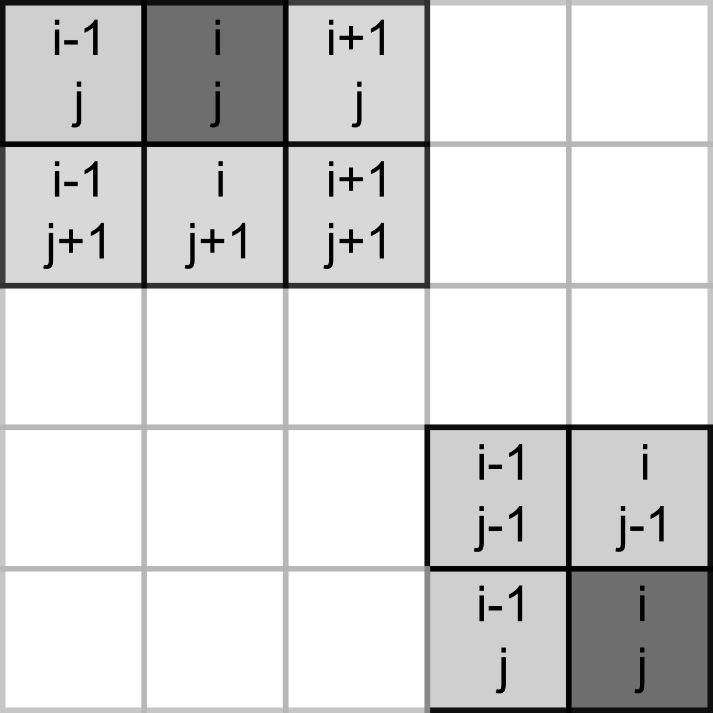
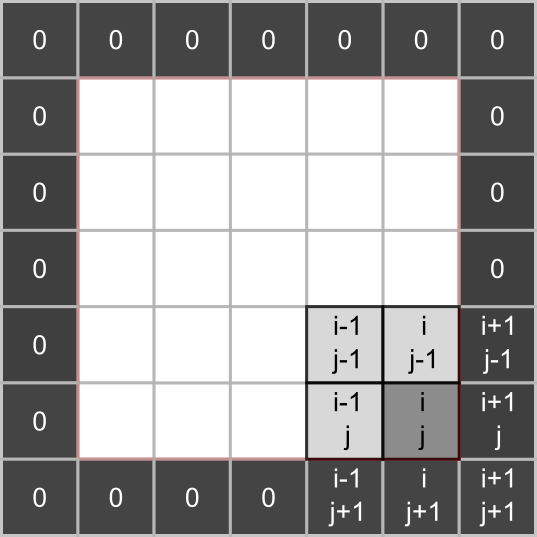

# Game of life (NumPy)

Today you will be programming the [Game of Life](https://en.wikipedia.org/wiki/Conway%27s_Game_of_Life) created by the British mathematician John Horton Conway. This is not really a game but rather a simulation where you set initial conditions up and observe how the population evolves. The rules, [as described on Wikipedia](https://en.wikipedia.org/wiki/Conway%27s_Game_of_Life), are very simple:

1. Any live cell with two or three live neighbours survives.
2. Any dead cell with three live neighbours becomes a live cell.
3. All other live cells die in the next generation. Similarly, all other dead cells stay dead.

Despite rules simplicity they produce remarkable evolution of a cell culture and give rise to many dynamic or static configurations. Here is an example simulation with a random starting state.

```{r, eval=knitr::is_html_output(excludes = "epub"), results = 'asis', echo = F}
cat(
'<div style="text-align:center;"><video controls>
    <source src="videos/game-of-life.m4v" type="video/mp4"> 
  </video></div>'
)
```

## Implementing  the rules
To program the game, you need to count live neighbors for every cell and use the rules above to decide whether it will be alive or dead on the _next_ iteration. The latter bit is important, you need to evaluate all cells at their current state, you cannot change their status during that period. Accordingly, on each iteration you need to a create _new_ cell culture and then overwrite the original one.

Our cells will live in a rectangular world, so you need to count number of neighbors in the 8 cells around it, as shown in the left hand-side image below (index / location of the dot in question is assumed to be _i, j_).

```{r echo=FALSE, fig.align='center', out.width='100%'}
knitr::include_graphics("images/game-of-life-grid.png")
```

However, things become slightly trickier, if a cell lies on the border of the world, as depicted on the right hand-side. The same rules for living or dying still apply but when counting neighbors you need to make sure that we do not try to access cells _outside_ of the world (marked in red). If we mess up our indexing, at best we will get an error, at worst we will access wrong elements. E.g., when our index is negative, Python will not issue a mistake but will simply count elements _from the end_.

## NumPy

Our cells live on a 2D grid which we can implement it as a list of lists. We will start with this implementation but you will see that using a matrix (a 2D array) is more natural. It also gives us opportunity to learn about [NumPy](https://numpy.org/) that provides a powerful and fast implementation of multidimensional arrays and numerous mathematical tools. It is one of the core non-standard (i.e., not included into the base Python distribution) libraries that is so prominent that you are expected to use it via its alias rather than by its full name:
```python
import numpy as np
```

I will not try to properly cover NumPy here, it is simply too vast. Rather, the purpose is to make you aware of opportunities that NumPy provides. The material below will contain just the bare minimum that we need for the game. I suggest that you read the [quickstart guide to NumPy](https://numpy.org/doc/stable/user/quickstart.html) before continuing and you should be ready to consult [the absolute basics for beginners](https://numpy.org/doc/stable/user/absolute_beginners.html) whenever you have questions about manipulating arrays.

## Boilerplate
Implement usual PsychoPy boilerplate with a external settings and context manager. The context manager should initialize PsychoPy window and a mouse, whic we will use it later to draw or erase individual cells. The size of the window that we need depends on the grid size that cells live at and the size of the individual cells. Define all three parameters - `grid width [cells]`, `grid height [cells]`, and `cell size [pix]` - in the settings file and compute window size on the fly. I've picked a 30 by 30 grid with each cell measuring 10 pixels (both widht and height, as cells are square).

::: {.rmdnote .program}
Create `GameContext` and `GameAbort` classes.<br/>
Put your boilerplate code into _code01.py_.
:::

## Visualizing an array
We will use a 2D Numpy array to encode our cells: $1$ will mean a living cell and $0$ will mean an empty space. But before we create the array, we need to think about how we will visualize it. There are at least three ways you can do it in PsychoPy. First, you can create a [Rect](https://psychopy.org/api/visual/rect.html#psychopy.visual.rect.Rect) (or some over visual primitive or even an image) for each cell and draw them one-by-one in a loop. However, that will be extremely inefficient and slow. Second, you can do effectively the same one-primitive-per-cell but via an efficiently implemented [ElementArrayStim](https://psychopy.org/api/visual/elementarraystim.html#psychopy.visual.ElementArrayStim) class. Finally, you can use a cool feature of [ImageStim](https://psychopy.org/api/visual/imagestim.html#psychopy.visual.ImageStim) class. So far, we only used names of external files as its `image` input but it can also take a 2D NumPy array and display it as an image. The latter approach is the simplest, so will start with. 

Let us start by 1) creating a 2D grid, 2) converting it to a 3D image (for an RGB color space, PsychoPy expects one 2D grid of values per channel), and 3) displaying it via [ImageStim](https://psychopy.org/api/visual/imagestim.html#psychopy.visual.ImageStim).

## A random matrix

There are different ways to create a matrices (2D arrays) in NumPy, see [Creating matrices](https://numpy.org/doc/stable/user/absolute_beginners.html#creating-matrices). Here, we will generate a matrix via NumPy [random generator](https://numpy.org/doc/stable/reference/random/generator.html) but you could also experiment with generating an empty grid via [numpy.zeros()](https://numpy.org/doc/stable/reference/generated/numpy.zeros.html) or a fully crowded one via [numpy.ones()](https://numpy.org/doc/stable/reference/generated/numpy.ones.html?highlight=ones).

Consult [documentation](https://numpy.org/doc/stable/reference/random/generator.html) and figure out how to generate a grid of integers that range between $0$ and $1$ (hint, take a look at the second example that covers generating integer values) creating a matrix of the given size (hint, take a look at the third example). I suggest playing with the code in a Jupyter notebook starting with a small size of the grid (so you could easily see it in the output, as for a 3×4 grid below). 
```{python echo=FALSE}
import numpy as np
rng = np.random.default_rng(1423)
grid = rng.integers(low=0, high=2, size=(3, 4))
print("Grid shape: ", grid.shape, "\n")
print(grid)
```

## From 2D to 3D
State of our cells is represented by a 2D NumPy array of size `[width, height]` but [ImageStim](https://psychopy.org/api/visual/imagestim.html) expects a 3D array of size `[width, height, 3]` that defines the image in the [RGB](https://psychopy.org/general/colours.html#rgb-color-space) or some other [color space](https://psychopy.org/general/colours.html). The simplest way to do this for our game is to [stack](https://numpy.org/doc/stable/reference/generated/numpy.stack.html?highlight=numpy%20stack#numpy-stack) the same 2D array three times. Zeros at all channels will give us black (empty space), whereas ones for all channels (a mixture of maximal red, green, and blue) will add to white. Again, experiment in a Jupyter notebook making sure that output and the [shape](https://numpy.org/doc/stable/reference/generated/numpy.ndarray.shape.html) of the 3D array are correct.

```{python echo=FALSE}
grid_3d = np.stack([grid] * 3)
print("3D grid shape: ", grid_3d.shape, "\n")
print(grid_3d)
```

## Correct values range
We are almost ready to use the 3D array as an image but our values go from $0$ to $1$, whereas the default RGB color space in PsychoPy expects values to go from $-1$ (black) to $1$ (white). Thus, we need to rescale the entire array via basic algebra. The good news is that NumPy is build on the idea of vectorization of operations, i.e., you do not need to apply the same operation to one element at a time (as you would do with Python list) but to the entire array at once.
```{python}
import numpy as np
a = np.array([1, 2, 3, 4])
a + 10

a * 10
```

As per usual, experiment in a notebook and check that values turn out as expected:
```{python echo = FALSE}
print(grid_3d * 2 - 1)
```

## Showing an image
Finally, we are ready to create and show the image! Use the code from a Jupiter notebook to generate a random grid of size `[grid width, grid height]` (from the settings), stack it, and rescale it. Then, simply create an [ImageStim](https://psychopy.org/api/visual/imagestim.html) passing the array as `image` and make sure that the image spans the entire window (what should it size be, given `"normal"` units?) and draw it in the main loop. Put a break point and use a debug console or watch tab to check whether image on the screen correspond to the original 2D grid.

::: {.rmdnote .program}
Create a random grid and show it in _code02.py_.
:::

## Slicing a border problem
We have a grid-to-image conversion but we are not out of the woods yet. The problem is the cells that live next to the border. They are of no trouble now but will become one, once we start counting their neighbors. Again, recall that we need to count all the neighbors _around_ each cell and for cells at the border that means trouble with indexes.
```{r echo=FALSE, fig.align='center', out.width='36%'}

```

We could be extra careful when indexing them, but there is a simpler solution: padding the grid with zeros. This way, we can use same rules for all _inner_ cells and never check or modify the empty padding.
```{r echo=FALSE, fig.align='center', out.width='50%'}

```

This solution still requires extra work. Namely, we need to generate an empty 2D grid that is 2 elements wide and taller than we need, fill the inner part with random $0$ and $1$, and then use only that inner part when stacking a 3D array for an image. Good news is, NumPy's [indexing and slicing](https://numpy.org/doc/stable/user/absolute_beginners.html#indexing-and-slicing) makes it very easy. Go back to the Jupyter notebook and lets redo the sequence.

We need a larger grid with zero padding. We could either generate a random grid and set padding to zero. Or, we can start with all zeros and put random integers to the inner part. The second approach is easier, so this is what we are going to do. First, generate grid full of [zeros](https://numpy.org/doc/stable/reference/generated/numpy.zeros.html?highlight=zeros#numpy.zeros) that is two elements wide and taller than we need. Then
