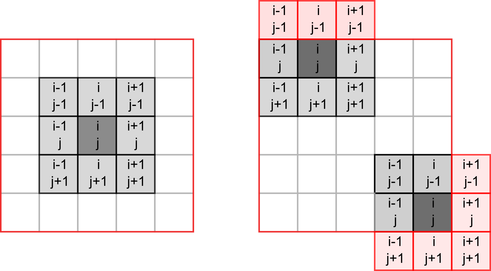

# Game of life (NumPy)

Today you will be programming the [Game of Life](https://en.wikipedia.org/wiki/Conway%27s_Game_of_Life) created by the British mathematician John Horton Conway. This is not really a game but rather a simulation where you set initial conditions up and observe how the population evolves. The rules, [as described on Wikipedia](https://en.wikipedia.org/wiki/Conway%27s_Game_of_Life), are very simple:

1. Any live cell with two or three live neighbours survives.
2. Any dead cell with three live neighbours becomes a live cell.
3. All other live cells die in the next generation. Similarly, all other dead cells stay dead.

Despite rules simplicity they produce remarkable evolution of a cell culture and give rise to many dynamic or static configurations. Here is an example simulation with a random starting state.

```{r, eval=knitr::is_html_output(excludes = "epub"), results = 'asis', echo = F}
cat(
'<div style="text-align:center;"><video controls>
    <source src="videos/game-of-life.m4v" type="video/mp4"> 
  </video></div>'
)
```

## Implementing  the rules
To program the game, you need to count live neighbors for every cell and use the rules above to decide whether it will be alive or dead on the _next_ iteration. The latter bit is important, you need to evaluate all cells at their current state, you cannot change their status during that period. Accordingly, on each iteration you need to a create _new_ cell culture and then overwrite the original one.

Our cells will live in a rectangular world, so you need to count number of neighbors in the 8 cells around it, as shown in the left hand-side image below (index / location of the dot in question is assumed to be _i, j_).

```{r echo=FALSE, fig.align='center', out.width='100%'}

```

However, things become slightly trickier, if a cell lies on the border of the world, as depicted on the right hand-side. The same rules for living or dying still apply but when counting neighbors you need to make sure that we do not try to access cells _outside_ of the world (marked in red). If we mess up our indexing, at best we will get an error, at worst we will access wrong elements. E.g., when our index is negative, Python will not issue a mistake but will simply count elements _from the end_.

## NumPy

Our cells live on a 2D grid. In principle, we could implement it as a list of lists but using a matrix (a 2D array) is more natural. It also gives us opportunity to learn about [NumPy](https://numpy.org/) that provides a powerful and fast implementation of multidimensional arrays and numerous mathematical tools. It is one of the core non-standard (i.e., not included into the base Python distribution) libraries that is so prominent that you are expected to use it via its alias rather than by its full name:
```python
import numpy as np
```

I will not try to properly cover NumPy here, it is simply too vast. Rather, the purpose is to make you aware of opportunities that NumPy provides. The material below will contain just the bare minimum that we need for the game. I suggest that you read the [quickstart guide to NumPy](quickstart.html) before continuing and you should be ready to consult [the absolute basics for beginners](https://numpy.org/doc/stable/user/absolute_beginners.html) whenever you have questions about manipulating arrays.

## Boilerplate
Implement usual PsychoPy boilerplate with a external settings and context manager. The context manager should initialize PsychoPy window and a mouse, whic we will use it later to draw or erase individual cells. The size of the window that we need depends on the grid size that cells live at and the size of the individual cells. Define all three parameters - `grid width [cells]`, `grid height [cells]`, and `cell size [pix]` - in the settings file and compute window size on the fly. I've picked a 30 by 30 grid with each cell measuring 10 pixels (both widht and height, as cells are square).

::: {.rmdnote .program}
Create `GameContext` and `GameAbort` classes.<br/>
Put your boilerplate code into _code01.py_.
:::

## Random noise image
We will use a 2D Numpy array to encode our cells: $1$ will mean a living cell and $0$ will mean an empty space. But before we create the array, we need to think about how we will visualize it. There are at least three ways you can do it in PsychoPy. First, you can create a [Rect](https://psychopy.org/api/visual/rect.html#psychopy.visual.rect.Rect) (or some over visual primitive or even an image) for each cell and draw them one-by-one in a loop. However, that will be extremely inefficient and slow. Second, you can do effectively the same one-primitive-per-cell but via an efficiently implemented [ElementArrayStim](https://psychopy.org/api/visual/elementarraystim.html#psychopy.visual.ElementArrayStim) class. Finally, you can use a cool feature of [ImageStim](https://psychopy.org/api/visual/imagestim.html#psychopy.visual.ImageStim) class. So far, we only used external files as its image input but it can also take a 2D NumPy array and display it as an image.
