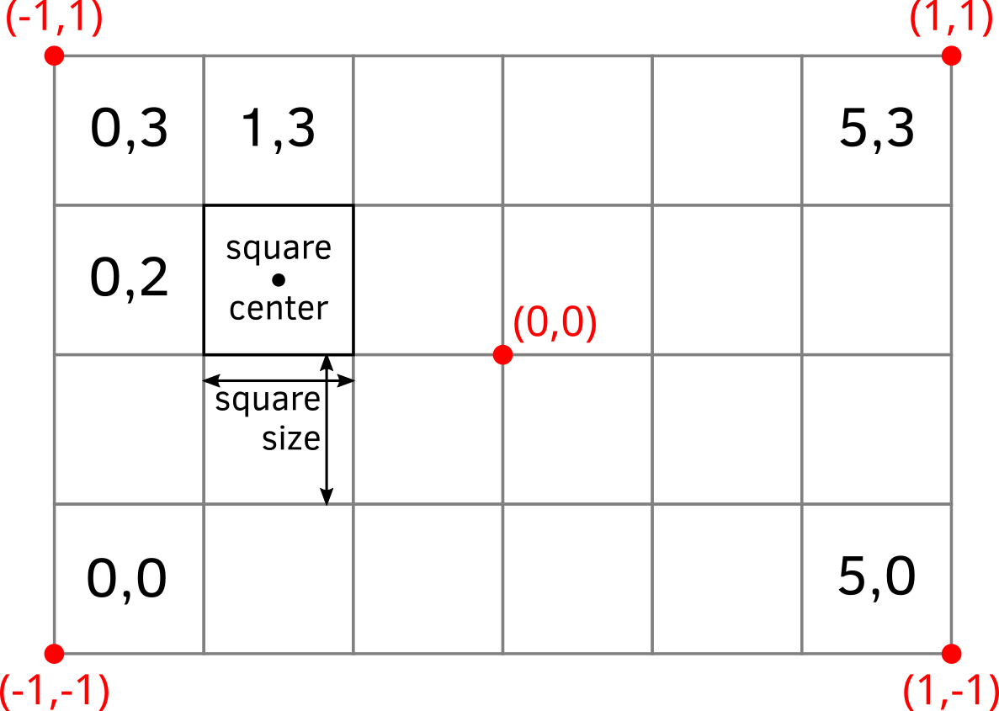

# The Snake

This chapter marks the beginning of the second semester in the course, therefore we will use our first game to refresh your knowledge of Python acquired previously. We will use classes (and their instances, objects), lists, conditional statements, loops, and external setting files to program a classic game of Snake. Consults previous chapters for any information you need to complete the game.

## Snake game: an overview

Today, we will program a good old classic: the snake game! The story is simple: you control a snake trying to eat as many apples as you can. Every time you consume an apple, snake's length increases. However, if you hit the wall or bite yourself, the game is over (or you lose one of your lives and game is over once you run out of lives).

Here is how the final product will look like.


As before, we will program the game step by step, starting with an empty gray PsychoPy window. Here is the general outline of how we will proceed:

1. Create boilerplate code to initialize PsychoPy.
2. Figure out how to place a square. We need this because our snake is made of square segments and lives on a rectangular grid made of squares.
3. Create a single segment stationary snake^[Not very exciting, I know. But one has to start somewhere!].
4. Make the snake move assuming a rectangular grid. 
5. Implement "died by hitting a wall".
6. Add apples.
7, Make the snake grow when it eats an apple.
7. Add check for biting itself (and dying).
8. Add bells-and-whistles to make game look awesome.

As you can see, each new step builds on the previous one. Because of that do not proceed to the next step until the current one works and you fully(!) understand what each line of code does. Any leftover uncertainty will linger, grow and complicate your life disproportionately!

## Minimal boilerplate

We need the [usual boilerplate](#psychopy-basics) code to get us going:

* Create a PsychoPy window (hardcode its size, as we will compute it from settings later on).
* Wait for any key press.
* Close the window.

::: {.rmdnote .program}
Put your code into _code01.py_.
:::

Do not forget to put the multiline comment at the top of the file, describing what we will be doing.

## Fancy boilerplate
In the game, our snake will be composed of square segments and move on a grid made out of squares. Thus, it would be much easier to define our window size based on the size of the grid (in squares) and that of individual squares (in pixels). This way we can figure out window's height as 

$$window~height~[in~pixels] = window~height~[in~squares] \times square~size~[in~pixels]$$

Note that the latter parameter determines how the game looks, double the size of the square in pixels and that will double both width and height of the window.

Now, let us think about the _units_ that we will use in our game. Recall that PsychoPy has [five different units](#psychopy-units) for size and position. So, which units should we pick to make it easier to draw squares? Reread section on [units](#psychopy-units) and think which units you would pick before continuing.

---

What is your decision? My suggestion would be `"norm"` units as they make sizing squares easy, as long as we use a suitable aspect ratio for the window itself. Good news is that the formula above automatically ensures the correct aspect ratio (think why this is the case).

Before we start coding the window size computation, create a [settings file](#settings-files) using the format of your choice that contains `grid size [in squares]` (with a list of two values or you could define it as `grid width [in squares]` plus `grid height [in squares]`) and `square size [in pixels]`^[I always add units in square brackets as a reminder to my(future)self. One can deduce units from code itself but documenting them explicitly makes your life much easier.]. I would suggest to start with a 30 × 20 grid as it should give us enough space to try things out but you can always increase the resolution of the game later. As for the square size, 20 pixels should be enough (but decide based on your screen resolution).

Add the code for loading the file into `settings` variable and then use the settings to compute the window's size. Test that it works correctly by doubling (or halving) the size of the grid or of the square size.

::: {.rmdnote .program}
Put your code into _code02.py_.
:::

## Fancier boilerplate
The code for computing window size belongs to the business logic of setting up a window and, therefore, should be part of a window class code. Therefore, let us define a new `GridWindow` class that will inherit from PsychoPy [Window](https://psychopy.org/api/visual/window.html#psychopy.visual.Window) class but modify the constructor to perform a window size computation. The new `__init__()` method should take grid size and square size as parameters, compute an actual size of the window in pixels, and call the `__init__()` method of the _parent_ [Window](https://psychopy.org/api/visual/window.html#psychopy.visual.Window) class to finish the setup (if you forgot how to call parent's methods, take a look at how we implemented [Flappy Bird class](#flappy-bird-class) by inheriting from [ImageStim](https://psychopy.org/api/visual/imagestim.html#psychopy.visual.ImageStim)). You already have all the code you need but in the main script, so the only thing you are doing is tidying things up by moving it into the constructor where it belongs and adjusting it for use of parameter and parent methods.

::: {.rmdnote .program}
Put your `GridWindow` class into a separate file (`gridwindow.py`?).

Modify the code and save main script into _code03.py_.
:::

## Adding a square
As I already wrote, our game will be made of squares. Snake is made of squares. Grid it lives on is made of squares. An apple is a square^[We will use a bitmap to make it look like an actual apple but it will need to be a square bitmap, so at the end the apple will still be square]. Which means we need to know the size of that square in the units of the window and we need to know where within the window each square should go based on its coordinates on the grid.

Computing the size of the square in units of window size is easy, so let us start with. If you used `"norm"` units for the PsychoPy window, we know that both its width and its height go from -1 (bottom) to 1 (top). We also know that we have to fit in `settings["grid width [in squares]"]` squares horizontally and`settings["grid height [in squares]"]` squares vertically (If you encoded grid size as a list of `[width, height]` then `settings["grid size [in squares]"][0]` and `settings["grid size [in squares]"][1]`). Compute the square width and height in the window units in the constructor method of the `GridWindow` and store it for later use as a tuple in `square_size` attribute. Also, store the grid size in an attribute (e.g., `grid_size`) as it will be useful for snake and apple classes later. Once you implemented the code, use [debugging](#debugging) to check that numbers make sense. E.g., if your grid is 20 squares tall then each square should be $0.1$ `"norm"` units tall.

Next, let us create a method that maps a position on the grid to a position in the window. This way, we can think about position of the snake or apples in terms of the grid but draw them in window coordinates. Create a new method `grid_to_win()` in the `GridWindow` class that takes a single parameter with a tuple of integers `(x_index, y_index)` with grid position (I called this argument `ipos`, here and in all other places, I am not counting the compulsory `self` parameter) and returns a tuple of floats `(x_pos, y_pos)` with the coordinates of the _center_ of the square in _window_ coordinates. Use [list comprehension](#list-comprehension) to simplify the code.

Take a look at the drawing below to see the geometry of the computation. The red text shows location of red points in _window norm_ units, whereas the black font shows location of a square in _grid index_ units. Note that you need to compute where the _center_(!) of the square should go.

<div class="figure">

<p class="caption">(\#fig:unnamed-chunk-2)Grid versus window coordinates</p>
</div>

Remember to document the method following [NumPy docstring format](https://numpydoc.readthedocs.io/en/latest/format.html).

Now, test this method by creating a [square](https://psychopy.org/api/visual/rect.html#psychopy.visual.rect.Rect) (you now get its size from the `GridWindow` attribute(s) that you created) in the main script and placing it at different locations on the grid. Run the code several times, using different grid indexes or adding several squares to check that it works as intended. I.e., for a 30×20 grid, a grid coordinate `0×0` should place a square at the bottom-left corner, whereas `14×9` should put it almost at the center.

::: {.rmdnote .program}
Put your code into _code04.py_.
:::

## A snake segment
Let us think about how can we represent a snake. It consist of one or more segments. The first one is its head, while the last one is its tail^[A single segment snake is a special case, as its head is also its tail!]. Thus, we can think about a snake as a [list](https://docs.python.org/3/tutorial/datastructures.html#more-on-lists) of individual segments.

Consider an individual segment. We need to 1) keep track of its location in _grid_ coordinate system and 2) have its visual representation — a square, just like the one you create during the previous exercise  — positioned in _window_ coordinate system. Good news is, you already have a method of the `GridWindow` class that maps the former on the latter, so as long as you know where the segment is on the grid, placing its square within the window is easy. Thus, each segment has two pieces of information associated with it and we could represent it as a [dictionary](https://docs.python.org/3/tutorial/datastructures.html#dictionaries) with two keys (`"pos"` (tuple of x and y in grid coordinates) and `"visuals"` (the square)) or, better still, as a class of it own.

Let us create a `SnakeSegment` class. Its constructor `__init__()` methods should take three parameters: 1) a PsychoPy [Window] object, 2) segment coordinates on the grid, 3) segment color. Save the grid coordinates into the `ipos` attribute (we need to keep track of it when the snake will start moving around) and reuse the code from the previous exercise when created a square. Store that square in `visuals` attribute and add a `draw()` method that simply calls the `draw()` method of the square^[It would be much simpler to inherit from [Rect](https://psychopy.org/api/visual/rect.html#psychopy.visual.rect.Rect) class directly but it does not work (raises an error), at least for the version 2021.1.4 that I use.].

Test the class by creating and drawing a snake segment in the main script. Define snake segment color in settings, create it inside a separate section `"snake"` as it will add more parameters later on.

::: {.rmdnote .program}
Put your `SnakeSegment` class into a separate file (_snaking.py_).

Modify the code and save main script into _code05.py_.
:::

## The snake
As already noted, a snake is just a list with snake segments. Create a new class `Snake`. Its constructor should take just two parameters: a PsychoPy window object and a dictionary with settings (a `"snake"` section of our `settings` variable in the main script). In the constructor, create a single segment and put it into a _list_ attribute `segments`. We will have just one attribute for now but using a list already helps us in the future. Place that only segment roughly at the center of the grid. Use `grid_size` attribute of the `GridWindow` to compute it (you will need to use a floor division [`\\`](https://docs.python.org/3/library/operator.html#mapping-operators-to-functions) for that). You should also store the window in an attribute for a later use, as we need it every time we create a new segment. 

In addition, implement a `draw()` method that draws all `segments` in a loop. Test your code by creating and drawing a snake in the main script.

::: {.rmdnote .program}
Put your `Snake` class into a separate file (_snaking.py_).

Modify the code and save main script into _code06.py_.
:::

## Get a move on!

Now we need to understand how we will move the snake given that it consist of many segments. Assume that we have a five segment snake that moves up, as in the picture below (segments are color coded to make it easier to see who goes where).


Technically, we need to move each segment to a new position. The very first "head" segment moves to the position above the snake. The second segment moves to where the head was before. The third moves into the previous position of the forth one, etc. We _can_ implement movement like that but instead we will utilize the fact that, unless colored as in the figure above, all segments look identical. Look at the uniformly colored snake below. We can "move" it by adding a new segment at a new location (growing a new head at the bitey end of the snake, marked as red) and clipping off the last tail segment (marked by the cross), so that the previously penultimate segment becomes the tail. The rest can stay where they are, saving us a lot of hustle when the snake is long!


In the program, we [list.insert(index, value)](https://docs.python.org/3/tutorial/datastructures.html#more-on-lists)^[We could also have used [dqueue](https://docs.python.org/3/library/collections.html#collections.deque) class from _collections_ library instead of the `list`. It is, essentially, a list that allows appending and popping from the left as well.] the new head segment at index 0 and we remove the tail via [list.pop()](https://docs.python.org/3/tutorial/datastructures.html#more-on-lists).

To keep things neat and tidy, we will implement two methods: `grow()` and `trim()`. Why not combine both actions into a single function? Strategic thinking! Once we add apples to the game, the snake will grow after consuming them by _not_ shedding its tail. Thus, separating these two functions now will simplify our lives later on^[To be honest, I have initially implemented it as a single `move()` function , wrote things up up to eating apples, realized the problem, returned and rewrote the notes. So, admittedly, it is a hindsight kind of strategic thinking.].

The `grow()` method should take just a single tuple parameter `dxy` with a direction of snake's movement. I.e., it will be `(-1, 0)` for leftward moving snake, `(1, 0)` for right moving, `(0, -1)` for up, and `(0, 1)` for down. Inside the method, you compute the coordinates for the new head segment based on the position of the current head (the very first element of the snake) and the direction of motion (`dxy`), create a new snake segment at that location, and insert it before all other elements.

The `trim()` method is even simpler as its just pops the last segment (trims the tail).

To test these functions, create a snake and call its `grow()` method a few times using the same or different directions. Check visually that it works, i.e., that there are correct number of segment (initial head + as many segments as `grow()` method calls) and that the snake was growing in a correct direction. Combine `grow()` and `trim()` calls to visually check the snake as well.

::: {.rmdnote .program}
Update `Snake` class adding `grow()` and `trim()` methods.

Test it in _code07.py_.
:::

## The game loop
Add a main game loop using a `user_abort` variable, so that it runs for as long as the `user_abort` is `False`. Inside the loop, draw the snake and check for keys without pausing the game. If a player pressed `"escape"`, change `user_abort` to `True` (the player decided to quit the game). If a player pressed `"space"` key, grow the snake in the direction of your liking and trim it. Thus, every time you press a _space_ key, the snake should move one square in the direction of your choice. Test the code!

::: {.rmdnote .program}
Add main loop in _code08.py_.
:::

## Self-motion
Our snake should move by itself. For this, we can call `grow()` and `trim()` methods on every iteration of the main game loop, not just when a player presses _space_. However, by default, when you call `win.flip()` it will synchronize your loop with the refresh rate of the screen (typically, 60 Hz). This means that we would call these methods 60 times per second or, to put it differently, the snake will move 60 squares per second. This is waaaay too fast, given that our original grid size was just 30×20 squares. To appreciate just how fast this is, remove `if key was space:...` conditional statement, and call grow/trim snake methods on every iteration and see the snake fly off the screen.

Instead, we should decide on snake's speed, e.g., 4 squares per second^[Note that speed does not need to be an integer number of squares per second. It can move at 1.5 squares per second, so 3 squares every two seconds.], and define it as a new parameter in settings. In the `Snake` class constructor, use this parameter to compute a new attribute `step_duration` that expresses the time needed to elapse before moving to a new square (i.e., interval between calls of grow/trim methods in seconds)^[Do it in the constructor, always define all attributes in the constructor, even if they are set to `None`.]. Why two variables that express the same information (interval is just an inverse of speed)? We could define `step_duration` directly in the settings but for a human it makes it harder to understand just how fast the movement will be. At least for me, a speed of `4 squares per second` is easier to comprehend than `0.25 second per square`. Thus, in cases like these, I prefer to have two variables, one human-oriented (in settings) and one computer-oriented (in the actual implementation, computed via a unit conversion). Remember, it is not just about writing a working code, it is about writing a code that is easy for a human to understand.

Also in the constructor, add a new `movement_clock` attribute creating either a [clock](https://www.psychopy.org/api/clock.html#psychopy.clock.Clock) or a [countdown timer](https://www.psychopy.org/api/clock.html#psychopy.clock.CountdownTimer) object^[Remember, they work the same they, it is just a question of whether you start from zero and check whether time is over `step_duration` ([clock](https://www.psychopy.org/api/clock.html#psychopy.clock.Clock)) or you start at `step_duration` and check whether the time ran out/is already negative ([timer](https://www.psychopy.org/api/clock.html#psychopy.clock.CountdownTimer)).] Then add a `reset_clock()` method and a `can_move` computed [property](#computed-attribute-property). The former should reset the clock or the countdown timer (whatever you have picked). The latter should return `True`, if the timer ran out and the snake can move to the next square (in this case you need to reset the timer!), or `False` if that is not the case. In the main script, call `reset_clock()` method before the main loop and inside of the main loop call `grow()` and `trim()` methods _only_ if the snake `can_move`.

Test your code by setting different snake speed.

::: {.rmdnote .program}
Update `Snake` class adding timer attributes and methods.

Test it in _code09.py_.
:::

## Describing direction using words

In our current design, we described direction as a tuple `(dx, dy)`. Let us change it, so that it is described using words `"up"`, `"down"`, `"left"`, and `"right"`. This is not strictly necessary but will make our lives somewhat easier later on when we add steering controls. More importantly, it will serve a didactic purpose as well, showing how you can use dictionaries to translate values from one representation to another.

Thus, in the main script, let us create a new string variable `direction` and set it to `"up"` (or any other direction you like). We will keep the `grow()` method as is and will translate individual strings to pairs of `(dx, dy)` values in the main script itself. E.g., `"up"` should correspond to `(0, -1)`, `"right"` to `(1, 0)`, etc.

We can implement this translation via if-elif conditional statements:
```python
if direction == "up":
  dxy = (0, -1)
elif direction == "right":
  dxy = (1, 0)
  ...
```

However, this approach introduces a lot of repetitive code and does not scale particularly well. Instead, we can use a [dictionary](#dictionaries) (let us call it `DIRECTION_TO_DXY` as it is another constant) with `"up"`, `"right"`, etc. string as keys and tuples `(0, -1)`, `(1, 0)`, etc. as values. This way, we can use current value of the `direction` variable as a key to get the `(dx, dy)` pair from `DIRECTION_TO_DXY` dictionary. Do this translation directly in the `grow()` method call rather than creating a temporary variable as in the if-elif examples above. Test the translation by changing `direction` and checking that the snake moves accordingly.

::: {.rmdnote .program}
Use `direction` and `DIRECTION_TO_DXY` in _code10.py_.
:::

## It is all about control
Playing the game would be more fun, if we could steer the snake! If the player presses _right arrow_ key, the snake should turn _clockwise_. Conversely, the _left arrow_ key, should turn the snake _counterclockwise_. We need to figure out two things. First, how to determine a new direction of motion given the current one and the key that was pressed. Second, we must decide when and how to change the value of `direction` variable. Let us tackle these problems one at a time.

Determining the new direction of motion is fairly straightforward. If current is `"up"` and key was _right_ (_clockwise_ rotation), the new direction should be `"right"`. If current is `"down"` and key was _left_, the new direction is again `"right"` (_counterclockwise_ rotation), etc. You could implement it as a bunch of `if-elif` statements or, better still, use the dictionary look up approach we implemented in the previous exercise. Here, you need a nested dictionary (dictionary inside a dictionary) `NEW_DIRECTION[key][direction]`. The first level has two keys `"left"` and `"right"` (so, effectively, counterclockwise and clockwise rotation) that selects which translation should be used and the second level is the dictionary that translates current direction into the new direction of motion. E.g., if current direction is `"down"` and key was `"right"`, `NEW_DIRECTION["right"]["down"]` should be `"left"` (rotating clockwise from `"down"` gets us to `"left"`). You know how define a simple dictionary. Good news, defining nested dictionaries follows the same rules, so should be straightforward.

Now let us think about when and how should we change a value of `direction` variable. The simplest approach would be to change it as soon as the player presses the key. However, because our snake does not move on every frame this could lead to some odd behavior. Imagine that our game is on "easy" mode, so that the snake moves very slowly (one square per second). In this case, the player could easily press _left_ twice during that second, which would make a snake move _backwards_, because its direction was changed by 180°. Snakes, at least our snake, cannot do this. Thus, we need a temporary variable, let us call it `new_direction`, which we will set every time the player presses the key but whose value will be transferred to `direction` only when it is time to move the snake (when the snake can move). We will compute it from the current `direction` and the key pressed. This way, even when the player presses _left_ key several times, the snake would still turn only once because we compute the each turn using the same original `direction` value and not the changed `new_direction` variable. This also means that players can "change their mind", as the last key press before the snake moves will determine the direction of motion.

::: {.rmdnote .program}
Add  `NEW_DIRECTION` and implement steering in _code11.py_.
:::

## Turning the hard(er) way
Let us implement the same "figure out new direction" code in a more complicated way. The purpose of the exercise is to challenge you, show you new methods of the list, and to demonstrate how you can think about a change of the direction as moving through the list. Implement it as a function called `compute_new_direction()`, which  will take two parameters (current direction and pressed key) and will return the new direction of rotation. You can put it above the main script or, better still, put it into a separate _utilities.py_ file. However, in cases like these, I find it useful to play with the code in a Jupyter notebook before turning it into a function, so you could try this approach instead of debugging.

Here is the idea. Imagine that you have a list `["left", "up", "right", "down"]`. For this list, rotation clockwise would correspond to moving through the list to the right (assuming that you jump to the beginning once you move past the last item). Conversely, rotation counterclockwise corresponds to moving to the left (again, assuming that you jump to the end of the list, once you went past the first item). As you see, rotation is expressed as a very intuitive "motion through the list".

For the actual implementation, first, define a local variable as a list in the order I've described. Next, you need to identify the location of the current direction within the list using [index()](https://docs.python.org/3/tutorial/datastructures.html#more-on-lists) method. Then, you need to figure out whether you increase or decrease that index (to move to the right or to the left), based on `pressed_key` parameter (you can use dictionary approach or a conditional assignment here). Finally, you need to control for range, so that index of `-1` becomes `3` (you went too far to the left) and index of `4` should become `0`. The most elegant way to do this, is using `%` [modulus](https://python-reference.readthedocs.io/en/latest/docs/operators/modulus.html) operation. Hint, `4 % 4` is `0`. What about `1 % 4`, `0 % 4`, or even `-1 % 4`? Check it in a Jupyter notebook to get an idea of what I am hinting at. And, of course, do not use `4` for division, use the [length](https://docs.python.org/3/library/functions.html#len) of the list, as it determines the range of values.

::: {.rmdnote .program}
Create `compute_new_direction() in _utilities.py_.

Use it instead of a dictionary look-up in _code12.py_.
:::

## Hitting the wall
We can control the snake but, at the moment, you can steer it off the screen or make it go through itself. Let us fix the former!

Add a new computed [property](#computed-attribute-property) `hit_the_wall` to the `Snake` class. The method should check whether the head of the snake (which segment is it?) is still within the grid that we defined (how do you check for that?). It should return `True`, if the head of the snake is outside of the grid limits (so, it is true that the snake hit the wall) or `False`, if it is still inside.

Test it by adding a new condition inside the main game loop. Check whether the snake `hit_the_wall` and, if that is the case, the game should be over. Think about the optimal place where to check for this. You could do it on every iteration but there is a more logical place for it in main loop. Where is it?

Test that the game quits after you successfully steered the snake into the wall. 

::: {.rmdnote .program}
Add `hit_the_wall` property to the `Snake` class.

Use it in _code13.py_.
:::

## Is this the snake?
In the next section, we will be adding apples to the game. The catch is that these apples should appear at a location that is _not_ occupied by the snake. Otherwise, we would generate apples directly into snake's stomach. Practical for the snake but defeats the purpose of the game. To rephrase this problem, we need a method that checks whether a particular grid location is occupied by the snake.

Add a new method `is_inside()` that takes a tuple with a grid location as a parameter and returns a logical value whether that grid location is occupied by the snake (i.e., by one of its segments). Document the function! Test the method via debugging. Calling it immediately after creating the snake with a location of the head (the only segment) or with a different location. Store a return value into a temporary variable and put a breakpoint at an appropriate place to check its value (or use a debug console).

::: {.rmdnote .program}
Add `is_inside()` method to the `Snake` class.

Test it in _code14.py_.
:::

## An inedible apple
Let us add that highly desirable fruit: the apple! We will use [an apple bitmap](material/apple.png)^[Created by [Jess Wiechler](https://openclipart.org/artist/cyanidecupcake).], so we will create a new class as a descendant of [ImageStim](https://psychopy.org/api/visual/imagestim.html#psychopy.visual.ImageStim) class. Its constructor should take `GridWindow` and `Snake` as parameters. In the constructor, you need to find a [random](https://docs.python.org/3/library/random.html#random.randrange) grid location that is not occupied by snake, store it in an `ipos` attribute and call the parent's constructor to initialize the image with an appropriate size and location (again, check [Flappy Bird class](#flappy-bird-class) or `GridWindow` class, if you forgot how to do this).

The only tricky part is finding the unoccupied location. There are many different strategies for doing this. The simplest one is to generate a potential location [at random](https://docs.python.org/3/library/random.html#random.randrange), check whether it is occupied by a snake (`is_inside()`?) and keep doing it until you find an unoccupied one.

In the main script, create an apple and draw it in the main loop. For a moment, the snake cannot eat it and will pass through it but we will fix this shortly.

::: {.rmdnote .program}
Create `Apple` class in _apples.py_.

Use the apple in _code15.py_.
:::

## Eating an apple
Apples exist for snakes to eat them! Let us add this functionality. The general idea is very simple. If the _head_ of the snake moves on to the grid location with an apple, you should not trim its tail. See how useful it was to split growing and trimming into two separate functions? Told you, strategic thinking! 

You need to add a conditional statement that if the snake's head _is_ on the apple, you should not trim the tail but create a new apple. What should you do, if there is no apple at that location?

::: {.rmdnote .program}
Make snake eat apples in  _code16.py_.
:::

## Eating yourself
Once our snake grows beyond four segments, it has an opportunity to bite itself^[Why at least five? Draw it on the grid and figure out whether it can eat itself with just four segments.]. For this, we need to check that, _after_ the snake moved, its head is _not_ at the same location as one of the segments of its body. Create a new property `bit_itself` that returns `True` or `False` based on whether that is the case. The property is very similar but not identical to `is_inside()` method you implemented earlier. What is the critical difference and why cannot you simply reuse that function?

Once you implemented `bit_itself`, you should check for that it does lead to the end of the game.

::: {.rmdnote .program}
Implement `bit_itself` property.

Use it in _code17.py_.
:::

## Bells and whistles: score
Now that we have a fully functional game, we can start adding non-essential but nice-to-have features to it. The first one will be the score. Create a new class `Score` that inherits from [TextStim](https://psychopy.org/api/visual/textstim.html#psychopy.visual.TextStim) and has an extra attribute `score` (initialized to $0$ in the constructor) and a method `plus_one()` that should increase the score by one and update the `text` attribute. As with an apple, initialize the [TextStim](https://psychopy.org/api/visual/textstim.html#psychopy.visual.TextStim) part by calling parent's `__init__()` method using appropriate parameters. I decided to put it at the top of the window and it reads **Score: XXX** but you are free to do it as you feel fit.

In the main script, create a `Score` object, draw it when appropriate and increase the score every time the snake eats an apple.

::: {.rmdnote .program}
Create `Score` class in _scoring.py_.

Use it in _code18.py_.
:::

## Bells and whistels: three lives
Let us give the player three attempts to achieve the top score. They have three lives, every time the snake dies, the game _but not the score_ resets: A single segment snake appears at the center and a new random apple appears elsewhere (where should you put the code to create them?). Once the snake dies three times, the game is over. Think how you can implement this three repetitions.

The score should be cumulative, so at the beginning of round two it should be equal to the final score of round one. Think how you can achieve this. _Another important point_: now you have two nested loop, one is for the game, one is for the round. When the snake dies, the round is over and, if you run out of lives, the game as well. When the player presses _escape_ both round **and** the game are over. Think about how you can implement it.

::: {.rmdnote .program}
Put your updated code into _code19.py_.
:::

## Bells and whistels: press space to start the round
At the moment, our round starts immediately. It would be friendlier, if the player would start it themselves. Before each round, draw _all_ visuals (snake, apple, score) plus a text "Press SPACE to start" and wait until either a _space_ or _escape_ key is pressed. In the former case, the trial should start. In the latter case, the player should exit the game.

::: {.rmdnote .program}
Put your updated code into _code20.py_.
:::

## Bells and whistels: showing remaining lives
Let us not just repeat the game three times but show the player how many lives they still have. Download the [heart.png](material/heart.png)^[This image was downloaded from [openclipart.org](https://openclipart.org/) and was created by [cliparteles](https://openclipart.org/artist/cliparteles)] and use it show remaining lives at the top-left corner of the screen: three hearts in round one, two hearts in round two, and just a single heart in round three. You will need to use (ImageStim)[https://www.psychopy.org/api/visual/imagestim.html#psychopy.visual.ImageStim] for this. Think about the size of images and their location. Hint: I created a list of heart images using list comprehension and drawing hearts definitely requires a for loop.

::: {.rmdnote .program}
Put your updated code into _code21.py_.
:::

## Bells and whistles: difficulty
At the moment, the difficulty of the game, the speed with which the snake moves, is fixed and the player has no way of choosing it. Let us create dialog that appears _before_ we create the window and start the game that will allow the player to choose between _easy_, _normal_, and _difficult_^[Or, if you played Doom, between _I'm Too Young To Die_, _Hey, Not Too Rough_,  _Hurt Me Plenty_, _Ultra-Violence_, and _Nightmare_.]. I leave it up to you to decide  which snake speeds correspond to each difficulty. You can have more than three options, if you want. However, they definitely should be define in settings file.

To create and run the dialog, use [Dlg](https://www.psychopy.org/api/gui.html#dlg) class from 
[giu](https://www.psychopy.org/api/gui.html) module of PsychoPy. Your challenge for today is to figure out how to use it based on the manual alone. Take a look at the example and experiment with in a separate file or a Jupyter notebook.

::: {.rmdnote .program}
Put your updated code into _code22.py_.
:::

## Bells and whistles: blinking "game over" message
Once the game is over (but not when a player pressed _escape_ key), show a blinking "Game Over" message _superimposed_ over the final static game screen. Thus, you need to draw all the game objects and messages (but without moving the snake) plus you show a text message that is on for 0.5 second and off for 0.5 seconds until the player presses _Space_ button. Hint: it should be a separate loop after the main game loop over rounds, logical variables and clocks/timers have definitely something to do with it.

::: {.rmdnote .program}
Put your updated code into _code23.py_.
:::

## Bells and whistles: sounds
Download [game-over-arcade.wav](material/game-over-arcade.wav)^[Downloaded from [freesound.org](https://freesound.org/) and created by [myfox14](https://freesound.org/people/myfox14/)] and [8-bit-game-over-sound.wav](material/8-bit-game-over-sound.wav)^[Also downloaded from [freesound.org](https://freesound.org/) and created by [EVRetro](https://freesound.org/people/EVRetro/)]. Use the former whenever the snake dies and use the latter when the player runs out of lives. Note, no sound should be played if the player pressed _escape_.

You will need to use `Sound` class from [sound](https://psychopy.org/api/sound/playback.html) module of PsychoPy. Important: use `Sound` class not a library-specific implementation such as `PTBSound` or `SoundDevice` classes. The PsychoPy will figure out which backend is the best (available at all) for you.

::: {.rmdnote .program}
Put your updated code into _code24.py_.
:::

## The sky is the limit
Good job! Lots of coding but now you have a cool retro game!

