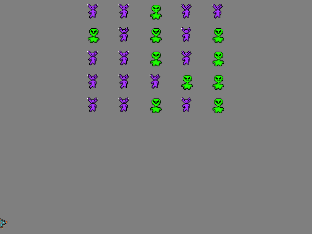

# Space invaders: mixins and duck typing {#space-invaders}

Today we will program a classic Space Invaders game with a twist. We will be using object-oriented programming but you will learn about _mixins_ and _duck typing_. Previously, you have learned how to ensure generalization --- common behavior for different classes --- via inheritance. E.g., when all visual stimuli inherit from the save `BaseVisualStim` class, you can be sure that they all have `size`, `ori`, and `pos` properties and that you can `draw()` them. However, this approach may not be best suited for cases when the same class must implement several different behaviours. One solution is to use _multiple inheritance_, so that a class is a descendant of several classes and, thus, get behavior from many of them. This is the canonical way of ensuring generalization but you can achieve same means differently.

## Mixins
One way to infuse a _common_ behavior into _different_ classes is via a mixin classes. These are classes that only define a single _behavior_ (i.e., a method) and nothing else. No constructor and, typically, no attributes. Thus, they are too limited to be used on their own but can be inherited from (mixed into the proper class) enabling that single behavior in the descendant.

Think about all creatures that can fly: insects, birds, bats, astronauts, etc. They do have a common ancestor but that common ancestor did not have the ability to fly. Instead, each line evolved that ability independently and all have evolutionary "cousins" that cannot fly. When programming, you can follow the same pattern of creating a common ancestor for flying and non-flying insects, then implementing ability to fly in the former. Do the same for birds, bats, astronauts, etc. If your implementation must be very detailed and creature-specific, this might be unavoidable. However, if your ability to "fly" is very abstract and, therefore, the same for all creatures in question, you will end up writing the same code for every insect, bird, bat class. An easy copy-paste, of course, but that means you get multiple places with identical implementation, so when you need to change it, you will have to make sure that you do it in all the places (and you gonna miss some, I always do). Alternative? Mixins! You create a class `FlightAbility` that implements that common abstract "flying" and, then, you inherit from that class whenever you need a flying someone. Mix a non-flying bird with the `FlightAbility` and it can fly! Mix it with an insect: Flying insect! You may also mix in more than one ability. Again, start with a bird that just walks around (a chicken). Add a mixin `FlightAbility` and you get a flying bird (a pigeon). Take the walking bird again and mix in `SwimAbility` and you get a swimming bird (a penguin). Mix in _both_ and you get a bird that can both fly and swim (a swan)!

You may not need mixins frequently but they are a powerful way of creating an isolated behavior that different classes might need without enforcing strict inheritance structure. PsychoPy is big on mixins. For example, it has `ColorMixin` that could be mixed-in to a visual class that needs to work with color, so it implements all the repetitive^[boilerplate] code for translating an arbitrary color representation (string, hexadecimal code, RGB triplet, HSL triplet, single grayscale value, etc.) into the internal RGB color value. It also has `TextureMixin` for classes that use textures for drawing objects. In our _Space Invaders_ game, we will use a Mixin class to mix in a "boom sound when exploded" behavior, common to both aliens and the player's ship.

## Duck typing
Alternatively, you might need your object to behave in a certain way but having a proper class hierarchy is an overkill because this is only one class and you might want some but not all the functionality. The idea is to use "duck typing", which comes from saying "If it walks like a duck, and it quacks like a duck, then it must be a duck." In other words, if the only things you care about are walking and quacking, do you need it to be an actual duck^[A man is hailing a taxi on a sidewalk. A car stops next to him. The guy looks at it and says "But where is the taxi sign on the roof?". The driver replies: "Do you need a taxi sign on the roof or a ride?"]? Will a goose that can walk and quack the same way do? Will a _dog_ that can walk and quack like a duck do? Obviously, the correct answer is "it depends" but in a lot of situations you are interested in a common behavior rather than in a common ancestor.

Duck typing is a popular method in Python. For example, `len(object)` is a canonical way to compute length of an object. That object could be a string `len("four")`, or a list `len([1, 2, 3, 4])`, a tuple `len(tuple(1, 4, 2))`, a dictionary `len({"A": 1, "B": 5})`, etc. The idea is that as long as a class has a concept of length (number of elements, number of characters, etc.), you should be able compute its length via `len()`. This is achieved by adding a _special method_ to the class `__len__(self)` that must return an integer. This is called a "hook method", as it is never called directly but is "hooked" to the `len()` function call. Thus, whenever you write `len(object)`, it is actually translated into `object.__len()__`^[Why not implement it as a method `object.len()` or, even better, as a read-only property `object.len`? Read [here](https://mail.python.org/pipermail/python-3000/2006-November/004643.html) for the justification.].

Another popular duck typing application is an implementation of an iterator: an object that yields one item at a time, so you can do lazy computation^[Lazy computation means that you compute or get only what is necessary right now, rather than computing or getting all items in one go.] or loop over them. You already know how to implement an [iterator as a function](#iteratorgenerator-functions) but it also be defined as a class with two special methods: `__iter__(self)` and `__next__(self)`. The former is called when iteration starts and it should perform a necessary initialization (e.g., setting internal counter to 0, shuffling elements, etc.) and must return an _iterator object_ (typically, a reference to itself). The `__next()__` method is called whenever the next item is needed: if you use iterator in the `for` loop, it is called automatically or you can call it yourself via `next(iterator_object)`. `__next()__` must  return the next item or [raise](https://docs.python.org/3/reference/simple_stmts.html#the-raise-statement) a [StopIteration](https://docs.python.org/3/library/exceptions.html#StopIteration) [exception](#exceptions), signalling that it ran out of items.

Note that an iterator does not require an implementation of the `__len()__` method! How come? If you have items you can iterate over, doesn't it make sense to also know how many (length of an object)? Not necessarily! First, if you use an iterator in a `for` loop and you just want to iterate over all of the items until you run out of them (which is signaled by the [StopIteration](https://docs.python.org/3/library/exceptions.html#StopIteration) exception). Thus, their total number and, hence, `len()` method is of little interest. Accordingly, why implement a function that you do not need^[Of course, if you _do_ need it, you should implement it. The point is that quite often you do not.]? Second, what if your iterator is endless (in that case, it is called a _generator_)? E.g., every time `__next__()` is called it returns one random item or a random number. This way, it will never run out of items, so the question of "what is its length" is meaningless unless you take "infinity" as an answer. This lack of need for `__len__()` for iterators is the spirit of duck typing: implement only the methods you need for your duck, ignore the rest.

Below, you will practice duck typing by implementing both `__len()__` and two special iterator methods as part of our `AlienArmada` class.

## Which one to use?
Now you know _three_ methods to produce common behavior: proper inheritance, mixins, and duck typing. Which one should you use? Depends on what you need. If you have many classes and you can have a well defined inheritance tree, use it. However, if you have some specific behavior that you need in some classes that is hard to fit with the inheritance tree, use mixins. If you have a single class that needs very specific functionality, such as an iterator: use duck typing. Using any one of them does not preclude you using others, but be moderate, using too many different paradigms will be confusing for you and a reader.

## Space Invaders

We will program a simple version of the game with a gradually descending alien armada. Your task is to capture all aliens by firing a teleport beam before one of them rams your ship or gets away. Below, you can see my version of the game.


As per usual, the plan is to move slowly in small steps to keep complexity of changes low. Here are the steps:

* Start with our usual PsychoPy boilerplate hidden in a context manager.
* Add a `Spaceship` and use mouse to move it along the bottom of the screen.
* Create an `Alien` and then the whole `AlienArmada`.
* Add `Laser`, then a `LaserGun`, so that the player can fire many laser shots by pressing left mouse key.
* Add check for hitting aliens with the laser and teleporting them off the screen.
* Use mixin to add teleport sound.
* Use cool iterators to cycle through lasers and aliens.
* Make alien armada move.
* Check for end-of-game.

Before we start, grab images that we will use for the game [space-invaders.zip](material/space-invaders.zip), created specifically for our seminar by Andrej Pastukhov, who said you absolutely must look at this link: [Wie die Pixelarts meines Sohnes Andrej entstanden sind](https://youtu.be/dQw4w9WgXcQ)^[No worries, it is safe. He says, you should understand. But I have no idea because, evidently, I am a dinosaur out of touch with modern trends.].

## Boilerplate
Create our usual boilerplate with an external settings file via a context manager with `GameAbort` exception handling. You can reuse the code from our last game but I strongly suggest checking that you understand every step. My suggestion for the window size is 640×480 because the sprites are 32×32 but chose whatever looks good on your screen.


::: {.rmdnote .program}
Create `GameContext` and `GameAbort` classes.<br/>
Put your boilerplate code into _code01.py_.
:::

## The spaceship
Create a new file for `Spaceship` class. It is remarkably boring as it just an image that moves left-right on a horizontal line. Thus, we will create it as a descendant of [ImageStim](https://psychopy.org/api/visual/imagestim.html#psychopy.visual.ImageStim) class. The only method that you need to define right now is the constructor `__init__()`. It should take [Window](https://psychopy.org/api/visual/window.html#psychopy.visual.Window) and image filename (should be stored in settings) as parameters (plus the compulsory `self`, of course) and call `super().__init__(...)` to initialize itself via the inherited constuctor. Apart from the two parameters you have, you also need to specify the initial position of the ship via `pos`. The ship should be somewhere just above the lower edge of the window. For me, vertical position of -0.9 worked quite nicely.

In the main code, create an object and draw it in the main loop.

::: {.rmdnote .program}
Create `Spaceship` class in a separate file.<br/>
Use it in _code02.py_.
:::


## The spaceship moves
Now, let us use the [mouse](https://psychopy.org/api/event.html#psychopy.event.Mouse) to control the horizontal position of the ship and, later on, left button to shoot. First, initialize the mouse in the context manager, so that it is one its attributes (then you can use it as `ctx.mouse`). Then, in the main loop, use [getPos()](https://psychopy.org/api/event.html#psychopy.event.Mouse.getPos) method to get the position of the mouse and use the _horizontal_ component to alter the position of the ship. Note that you _cannot_ assign just a horizontal or vertical components to the position via `.pos[0] = ...`. In my PsychoPy 2021.1.4 it does not generate an error but does not change the actual position either. Thus, you need to assign a tuple of `(new horizontal component, original vertical component)` (the ship should stay at the same vertical position throughout the game). Test moving your spaceship around. You can make mouse invisible (see [documentation](https://psychopy.org/api/event.html#psychopy.event.Mouse)) to make it more immersive.

::: {.rmdnote .program}
Add mouse to `GameContext`<br/>
Use mouse to move ship in _code03.py_.
:::

## An alien appears
Before we create an alien armada, let us create a single alien. The class will be very basic, which is why, we will put both `Alien` and `AlienArmada` into the same file (so, think about its filename). The class itself is similar to the `Spaceship`. The only differences are that it should take (and pass) `pos` parameter (unlike the spaceship that always appears at the same location) and that  the image should be [randomly picked](https://docs.python.org/3/library/random.html#random.choice) from a tuple of filenames (_alien-1.png_ and _alien-2.png_, the names should be defined in the settings in an "aliens" group of settings). For testing, place a few aliens at arbitrary locations on the screen to check that an alien image is randomly picked. Do not forget to draw them in the main loop.

::: {.rmdnote .program}
Create an `Alien` class<br/>
Use them in _code04.py_.
:::

## Using names to indicate access restrictions
Before we create an alien armada, we need to make a quick detour to talk about [naming conventions](https://peps.python.org/pep-0008) for attributes and names of classes. Unlike most other languages, Python does not have private attributes or methods, i.e., attributes or methods accessible only from inside the object. If you come from Java or C#/C++, a thought that you can call _any_ method and  modify _any_ attribute from outside should give you chills, as it becomes impossible to predict object's behavior. Python "solves" the access problem via a "gentlemen's agreement" that methods and attributes whose names start either with `__` or `_` should be _considered_ private. In other words, you should not use them directly. In case of `__`, you are also prevented from doing it in a straightforward way, as the name is [mangled](https://peps.python.org/pep-0008/#descriptive-naming-styles). In the example below, you cannot access the `__color` attribute directly:


```python
class ExampleClass:
  def __init__(self):
    self.__color = "red"

example = ExampleClass()

# raises AttributeError
print(example.__color)
#> Error in eval(expr, p): AttributeError: 'ExampleClass' object has no attribute '__color'
```

But as Python does not have truly private attributes, you can still access it via its mangled name`object._<ClassName><hidden attribute name>`:

```python
example._ExampleClass__color
#> 'red'
```
However, this is a last resort sort of thing that you should use only if you absolutely must access that attribute or method and, hopefully, know what you doing.
  
As noted above, you can also come across attributes with a _single_ leading underscore in the name, e.g. `_color`. This is a weak “internal use” indicator, so they are fully visible. However, the leading underscore  does _hint_ that this attribute or method should be _considered_ private. So, if you see an attribute like `_color`, you should pretend that you know not of its existence and, therefore, you never read or modify it directly. Of course, this is only an _agreement_, so you can always ignore it and work with that attribute directly^[On a side note of doing crazy things that you should not: You can replace a class method without inheritance with your own at run time, this is called a [monkey patch](https://en.wikipedia.org/wiki/Monkey_patch)!]. However, this almost certainly will break the code in unexpected and hard-to-trace ways.

## An alien armada appears
One alien is neither scary, nor challenging enough. We want more! For this, we will create an `AlienArmada` class with a twist. It will be responsible for creating a grid of aliens, moving them around (our chance to learn about special setter methods), allowing outside processes to iterate over them (iterator duck typing), and reporting the number of remaining aliens (length duck typing). As usual, we will do this one step at a time.

Start by creating an `AlienArmada` class, below the `Alien` class. Our initial version will the following methods

* a compulsory constructor,
* `spawn()` that creates and places individual aliens,
* `draw()` that draws aliens,

and attributes

* `win` a PsychoPy window,
* `__pos` that is a tuple with the position of the armada center within the window,
* `aliens` which is a list with alien objects.

You must also expand your settings. By now you should already have an `Aliens` settings section with alien images' filenames. To define the armada, we need also need to add

* `"Initial position"`: center of the armada, I've picked `[0, 0.5]` but you can always optimize it later on.
* `"Grid size"`: number of aliens horizontally and vertically, I've used `[7, 3].
* `"Grid step [norm]"`: distance between aliens in "norm" units, I've picked 0.2.


_Constructor_: we will create and place aliens in a separate method `spawn()`, so our constructor will be very simple. As far as parameters are concerned, you need to pass a [Window](https://psychopy.org/api/visual/index.html) for creating `Alien` objects and a dictionary with armada-specific settings. Store both of them as attributes for later use, initialize `__pos` to the `"Initial position"`, initialize `aliens` to an empty list and `spawn()` them (again, all attributes must be initialized in the constructor, even if to an empty list or `None`).

In the `spawn()` create aliens on a grid based on your `"Grid size"` and `"Grid step [norm]"` settings, so they are centered at `AlienArmada`'s position (`__pos`). All aliens go to `aliens` attribute, of course. Remember that they need a list of file names for visuals but you have it covered as you have them in the settings. It should look like this:



::: {.rmdnote .program}
Create the `AlienArmada` class.<br/>
Use it in _code05.py_.
:::

## A laser shot appears
Now we need to create `Laser` class (in a separate file). Eventually, when a player presses left mouse button, the laser should appear at the location just above the ship and fly up with a certain speed. As per usual, all parameters for laser (and `LaserCannon`) should be stored in the settings file under a separate section (e.g., `laser`). For the moment, we only need to specify `speed [norm/sec]` (laser shot speed in norm units per second, I've picked 1 norm / second, so it takes 2 seconds for the shot to fly across the screen)) and, optionally, filename of the laser bitmap (but that could be also hardcoded, as we have only one image).

Let us take care of the first step: creating a laser shot just above the sheep. Create `Laser` class as a descendant of [ImageStim](https://psychopy.org/api/visual/imagestim.html#psychopy.visual.ImageStim) (just like our `Spaceship` and `Alien` classes). It should take `win`,  `pos`, and `speed` as arguments and call the ancestor constructor. The `pos` argument is the position of the ship (that fired it) but the laser must appear _above_ it, so you need to adjust `pos[1]` for that (hint, you can get window height from `win.size[1]` and you know that sprites are 32 pixels high). The `speed` is in _norm units per second_ from the settings. You need to save the `speed` value in an attribute for later use.

For testing, create a laser object right after you create the ship itself and draw it in the main loop. It won't move but you will be able to see whether you've got the height right.

::: {.rmdnote .program}
Create the `Laser` class.<br/>
Use in _code06.py_.
:::

## The laser shot flies
Let us add `fly()` method to the laser. It will be very simple, every time it is called the laser should move upwards. As in a Moonlander game, we need a [clock](https://psychopy.org/api/clock.html#psychopy.clock.Clock) to measure the time elapsed between the updates, so create it as an attribute in the constructor. In the `fly()` method, you need to figure out the time elapsed since the last call or since the shot was created (don't forget to reset the timer after that) and move the shot based on its `speed` and elapsed time.

Remember to call `fly()` method in the main loop and see how the laser flies up and off the screen.

::: {.rmdnote .program}
Add `fly()` method to `Laser` class.<br/>
Use it in _code07.py_.
:::

## We want more lasers!
Now we will create a `LaserGun` class that will take care of individual laser shots. It will 1) create a new `Laser` object whenever we `fire()` from it, 2) ensure that it does not overheat by allowing only one shot every N seconds (another parameter to be defined in the settings file, let's say 0.3 s), 3) call `draw()` and `fly()` methods for all laser shots. We will create the class `LaserGun` in the same file as the `Laser`.

In the constructor, pass PsychoPy window variable and a dictionary with laser gun specific settings (these should include the `speed` that you specified earlier and the cool down period in seconds) and store both in attributes for later use. Initialize `lasershots` attribute with empty list, and create a cool down [timer](https://psychopy.org/api/clock.html#psychopy.clock.CountdownTimer).

The `fire()` method should take position of the ship as a single parameter. If enough time passed since the last shot (check the cool down timer for that), create a new `Laser` at the supplied position, add it to the `lasershots` list, and reset the cool down timer. In `draw()`/`fly()` simply draw/fly all `lasershots`.

For testing, use `LaserGun` in place of the `Laser`. Both have same `draw()` and `fly()` methods that you should be calling already.  In the main loop, check if left mouse button is [pressed](https://psychopy.org/api/event.html#psychopy.event.Mouse.getPressed). If it is, `fire()` the laser gun, passing current position of the ship to it.

::: {.rmdnote .program}
Create `LaserGun` class.<br/>
Test it in _code08.py_.
:::

## Too many lasers!
We do not need our lasers once they fly of the screen, so we should remove them. First, we need to know which `Laser` shot has `expired`": is off the screen (this section) or hit its target (the next section). For this, modify the `Laser` class by adding an `expired` attribute that is set initially to `False` (the shot is good). In addition, write a new method `check_screen_limits()` that would set `expired = True` if the shot is above the upper edge of the window but leaves `expired` as is (unmodified!) otherwise (the shot could be within the screen and get `expired` because it hit an alien).

Next, add a `cleanup()` method to the `LaserGun` class that will call `check_screen_limits()` for all shots and then remove all `expired` ones. This is both simple and tricky! Conceptually simple: you loop over `lasershots` and delete any object that is `expired`. The easy way is to do it via [list comprehension](#list-comprehension) (deleting objects by not including them in the updated list) but for didactic reasons we will use [del](https://docs.python.org/3/tutorial/datastructures.html#the-del-statement) instead. If you have a list and you want to delete a second element, you write

```python
x = [1, 2, 3, 4, 5]
del x[1]
print(x)
#> [1, 3, 4, 5]
```

However, there is a catch. Imagine that you want to delete second and forth elements, so that the result should be `[1, 3, 5]`. If you just delete second and then forth elements, you won't get what you want:

```python
x = [1, 2, 3, 4, 5]
del x[1]
del x[3]
print(x)
#> [1, 3, 4]
```

Do you see why? Solution: start deleting from the end, this way indexes of earlier elements won't be affected:

```python
x = [1, 2, 3, 4, 5]
del x[3]
del x[1]
print(x)
#> [1, 3, 5]
```

Note that you must use `del list[index]` format, so you need to use indexing in the for loop of the `cleanup()` method:
```python
for ishot in backwards-index-built-via-the-range-function:
  check if lasershot has left the screen
  if self.lasershots[ishot] needs to be deleted:
    delete that self.lasershots[ishot]
```

Add `cleanup()` call to the main loop right after the `fly()` to automatically delete expired shots. Once you fired a few shots and they are all off the screen, put a breakpoint and check that the `.lasershots` is empty (your `cleanup()` works as it should).

::: {.rmdnote .program}
Add `expired` property to `Laser`.<br/>
Add `cleanup()` method to `LaserShot`.<br/>
Use `cleanup()` in  _code09.py_.
:::

## I am hit! I am hit!
Now we need to check whether a lasershot hit an alien. In that case, all the relevant aliens and shots must be removed. Removing lasershots is easy: We just set them as `expired` and `cleanup()` does the rest. Clearly, we need the same mechanism for the aliens.

Add `hit` attribute to the `Alien` class and initialize to `False` (an alien is not initially hit). In `AlienArmada` class, implement a `cleanup()` method, analogous to one in `LaserGun` that will delete any alien that is `hit`. Add the call to it in the main loop at the same location as for the `LaserGun`. You can test it by setting `hit` to `True` for one of the aliens and it should be missing.

Now for the actual check. You should loop over all aliens and laser shots attributes of `AlienArmada` and `LaserGun` checking _every pair_ on  whether they [overlap](https://psychopy.org/api/visual/imagestim.html#psychopy.visual.ImageStim.overlaps). If they do, set laser shot to `expired` and the alien as `hit`. Do this check _before_ the clean up but _after_ the laser shots fly.

Test it!

::: {.rmdnote .program}
Update `Alien` and `AlienArmada` classes
Check for laser shots hitting aliens
in _code10.py_, .
:::

## Duck typiing iterators
In the precious exercise, you used `aliens` and `lasershots` attributes directly in the loop. However, let us inject some coolness into our code and turn `AlienArmada` and `LaserGun` classes into iterators. Recall that you need to implement two special methods for this: `__iter__(self)` and `__next__(self)__`. The first one, initializes the loop, the second one yields the next item. The actual implementation is very simple. You need to create a new attribute that will be used to track which item you need to yield, call it `iter` and initialize it to `None` in the constructor.

In the `__iter__(self)`, initialize the counter to `0` and return `self`: a returning the reference to the iterator, which is the object itself^[You can cheat and return the reference to the list attribute itself and it'll do the rest but do not do it for didactic purposes.]. In the `__next__(self)`, check if `iter` is within the (`aliens` or `lasershots`) list length. If it is not (i.e., you ran out aliens/shots to iterate over), `raise StopIteration`. If it is, increase the iteration counter and return the element it was indexing _before_ that: Think about why you need to return `self.aliens[self.iter - 1]` rather than `self.aliens[self.iter]` or how you can use a different starting value and range check to avoid this. 

Do this for both classes and use them in for loops directly, i.e. looping over `aliens` and `laser` instead of `aliens.aliens` and `laser.lasershots`.

Test it! It should work as before, of course, but with cooler duck typing inside!

::: {.rmdnote .program}
Turn  `LaserGun` and `AlienArmada` into iterators.
Use them as iterators in _code11.py_.
:::

## Got'em all!
Now, implement `__len__()` method for `AlienArmada` class that returns the number of remaining aliens. In the main loop, use it via `len()` function to check whether you won: no aliens left, the game is over. Use `len()` with the object, not with its `aliens` list attribute!

::: {.rmdnote .program}
Add `__len__()` special method to `AlienArmada` class.
Use it to check whether all aliens are hit
in _code12.py_.
:::

## Ping!
Now let us use a `HitSoundMixin` class that defines a single `hit()` method (no constructor!) that plays the _teleport.wav_ sound^[Created by Sergenious and obtained from [freesound.org](https://freesound.org/people/Sergenious/sounds/55853/)] from [materials](material/space-invaders.zip). It can be a single line method when you both create and play the sound in one go, no temporary variable or an attribute are required. When you use it as an ancestor for the `Alien` class, it has that `hit()` method. Call it when you set _hit_ to `True`.

::: {.rmdnote .program}
Create `HitSoundMixin` class.
Mix it into the `Alien` class.
Use it in _code11.py_.
:::

## Virtual attributes via getters and setters {#getter-setter}
Our next detour is to learn how you can create a private attribute (within [the limits of Python](#access-restrictions), of course). Recall that we have a `__pos` attribute of an `AlienArmada` class that defines its location. The catch is that changing the position of the armada means changing position of all the aliens that constitute the armada. This means that we need write a method that receive a new position for the armada and updates both the `__pos` attribute and positions of individual aliens. And that is exactly what getter/setter methods are for. They are declared via special _decorators_^[These are functions that "decorate" you function and are called _before_ your function is called. They are like gatekeepers or face control, so they can alter whether or how your function is executed.]: `@property` and `@<name>.setter`. You already know the former one that we used to compute a value on-the-fly. But it also be used to get a value of a "private" attribute, which is why it is called a "getter" method. The latter decorator, is for a "setter" method that _sets_ a new value to a private attribute. The idea of using them together is to isolate an actual attribute value from the outside influence. It is particularly helpful, if you need to control whether a new value of an attribute is a valid one, needs to converted, additional processing, etc. For example, `color` attribute of the rectangle stimulus uses this approach, which is why it can take RGB triplets, hexadecimal codes, or plain color names as a value and set the color correctly.

Here is a sketch of how it could work for a virtual attribute for `color`. One typically creates an _internal_ attribute with almost the same name, e.g., `_color` or `__color`. The value is stored and read from that internal attribute by getter and setter methods:
```python
class ExampleClass:

  def __init__(self):
    self.__color = "red"

  @property
  def color(self):
    """
    This is a getter method for virtual color
    attribute.
    """
    # Here, we simply return the value. But we could 
    # compute it from some other attribute(s) instead.
    return self.__color
    
  @color.setter # not the most elegant syntax, IMHO
  def color(self, newvalue):
    """
    Note that the setter name has THE SAME name as the getter!
    It sets a new value and does not return anything.
    """
  
    # Here, you can have checks, conversion, 
    # additional changes to other attributes, etc.
    self.__color = newvalue
    
    
example = ExampleClass()

# get the value, note the lack of () after color
print(example.color)

# set the value
example.color = "blue"
```

Note that there is no _actual_ attribute `color`^[Just like there is no physical phenomenon called "color"!], yet, our code works as if it exists. 

There is another twist to the story. If you only define the getter `@property` method but no setter method, your hidden property is read-only^[Note that you cannot have write-only property, you must have either getter alone or both.]!

## The alien armada jumps
Currently, our aliens are sitting ducks. No fun! They need to get a move on. But before we can move alien armada around, we need to be able to change its position. So let us write getter/setter methods for it. To start with, define a getter, as it only needs to return the value of the hidden position attribute.

Now to more complicated and, hence, fun bit! Remember, we need to move _all_ individual aliens relative to the center of the armada. For this, 

1. compute the _change_ in its position based on current and new value, 
2. use it to alter position of individual aliens based on their current position, 
3. store the new position in the private attribute.

Test it by making armada jump to a random location every time you press _space_ button. The armada should keep its formation!

::: {.rmdnote .program}
Implement getter/setter methods for `__pos` in `AlienArmada`.
Test it in _code12.py_.
:::

## The alien armada moves
Our alien armada will move downwards along a sine trajectory: 

$$x = x_{max} \cdot sin(2 \pi f \cdot (y-y_{origin})) $$
where $x_{max}$ is maximal deviation of the _center_ of the armada from the middle of the screen (I've set it to $0.25$), the $f$ is the frequency, i.e., how fast is horizontal movement (I've set it to $3$ but you can see how much slower it would be for $1$ in the plot below), $y$ is the current vertical coordinate of the armada and $y_{origin}$ is the initial one ($0.5$ in my case). As with all other parameters, these should be part of the settings file plus `vertcal speed [norm/sec]` that defines how fast the armada will fly down (I would set it to 0.1, so it takes 15 seconds to fly down). 


<!-- -->

For the armada to fly, we need to add a timer (in the constructor) and define a `fly()` method that

1. computes the times since the armada creation
2. computes current vertical position based on the starting location, elapsed time (from the timer), vertical speed defined in settings
3. computes current horizontal position given the formula above and the relevant settings
4. updates current position via a simple `self.pos = (new_x, new_y)` (the setter method will take care of the rest)

In the main loop, call `fly()` when you call it for laser gun.

::: {.rmdnote .program}
Add `fly()` method to `AlienArmada` class.<br/>
Use it in _code13.py_.
:::

## The alien armada wins: crash!
So far, the player always wins. Let us make it more dangerous! They will lose if either an alien crashes into the spaceship or if the armada goes past the ship. Implement the former the same way as you checked whether laser shot hit an alien: loop over aliens and see if they overlap with the spaceship (game over if they do). Implement and test.

::: {.rmdnote .program}
Implement crash-into-ship in _code14.py_.
:::

## The alien armada wins: missed them!
The second way to lose the game, is if at least one alien got past the ship. For this, we need to check the position of the _lowest_ alien and if it is lower than that of the spaceship, the game is over. You can do it in the same loop you are checking for the hit but, for didactic reasons, let us practice `@proprety` a bit more. Implement a new computed (read-only) property `lowest_y` of the `AlienArmada` class that will return the y-coordinate of the lowest alien in the armada. You need to loop over individual aliens to find the lowest y and return it. There are different ways to do it, come up with one yourself! In the main code, add the check and make sure the game is over, if aliens got past the player.

::: {.rmdnote .program}
Add `lowest_y` computed property to `AlienArmada` class.<br/>
Use it in _code15.py_. 
:::

## Mixin teleport
Mix in the teleport sound method to the `Spaceship` and play it if alien crashed into it.

::: {.rmdnote .program}
Mix in teleport to `Spaceship` class.<br/>
Use it in _code16.py_.
:::

## Game over message
Create a blinking game over message that will reflect the outcome. Something like this but use your imagination:

* "Congrats!", if the player won.
* "Crash! Boom! Bang!", if the player was hit.
* "They got away!", if the armada got past the player.

One way to simplify you life is to rename `gameover` variable into the `gamestate` variable. Initially, it could be `"playing"`, so your loop repeats `while gamestate == "playing"`. Then, you can set it based on the type of the event (`"victory"` when player wins, `"hit"` when they were hit by the armada, `"missed"` if aliens got away) and use it after the main loop to determine which message to show. Better still, use dictionary for this instead of if-else. Or "cheat" and store the message in the variable itself.

::: {.rmdnote .program}
Put your updated code into _code17.py_.
:::

## We want more!
You have a solid game but it can be improved in many ways. Score? Difficulty? More levels? Aliens shooting back at you? Anything is possible!
