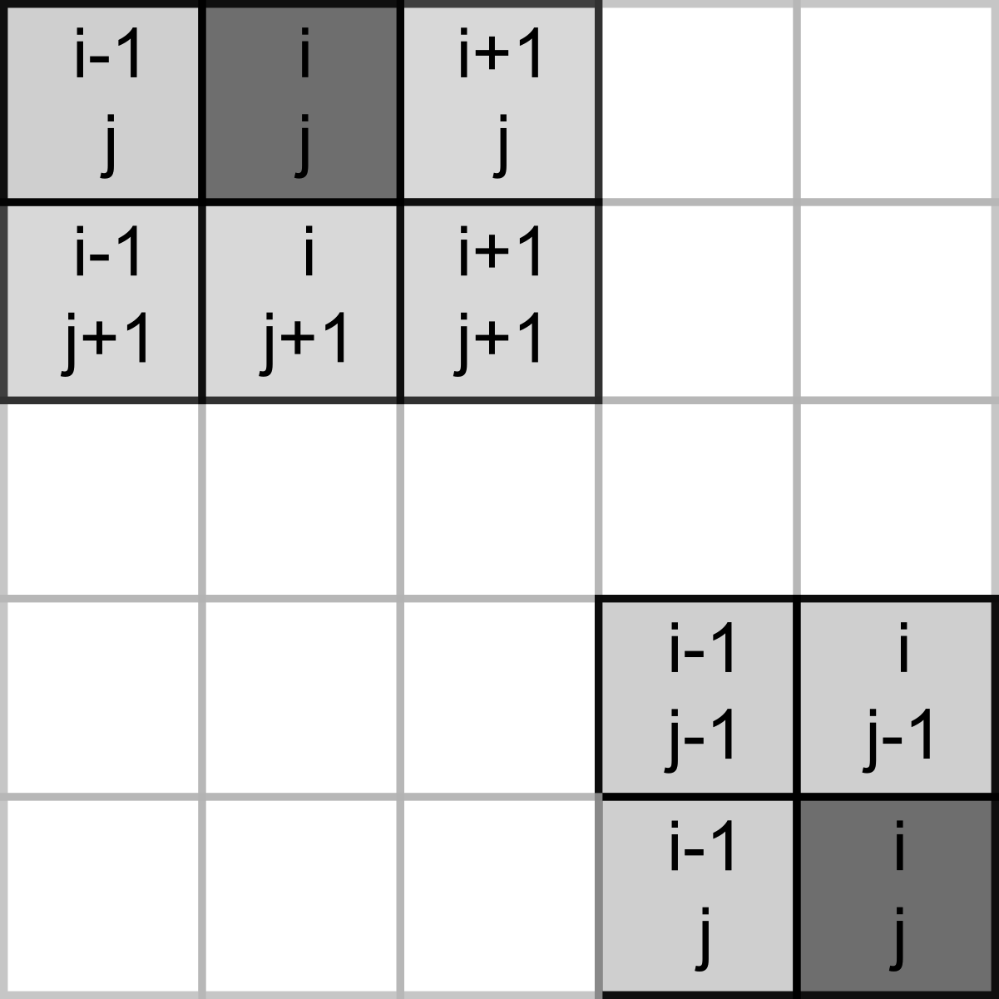

# Game of life (NumPy)

Today you will be programming the [Game of Life](https://en.wikipedia.org/wiki/Conway%27s_Game_of_Life) created by the British mathematician John Horton Conway. This is not really a game but rather a simulation where you set initial conditions up and observe how the population evolves. The rules, [as described on Wikipedia](https://en.wikipedia.org/wiki/Conway%27s_Game_of_Life), are very simple:

1. Any live cell with two or three live neighbors survives.
2. Any dead cell with three live neighbors becomes a live cell.
3. All other live cells die in the next generation. Similarly, all other dead cells stay dead.

Despite rules simplicity they produce remarkable evolution of a cell culture and give rise to many dynamic or static configurations. Here is an example simulation with a random starting state.


## Implementing  the rules
To program the game, you need to count live neighbors for every cell and use the rules above to decide whether it will be alive or dead on the _next_ iteration. The latter bit is important, you need to evaluate all cells at their current state, you cannot change their status during that period. Accordingly, on each iteration you need to a create _new_ cell culture and then overwrite the original one.

Our cells will live in a rectangular world, so you need to count number of neighbors in the 8 cells around it, as shown in the left hand-side image below (index / location of the dot in question is assumed to be _i, j_).


However, things become slightly trickier, if a cell lies on the border of the world, as depicted on the right hand-side. The same rules for living or dying still apply but when counting neighbors you need to make sure that we do not try to access cells _outside_ of the world (marked in red). If we mess up our indexing, at best we will get an error, at worst we will access wrong elements. E.g., when our index is negative, Python will not issue a mistake but will simply count elements _from the end_.

## NumPy

Our cells live on a 2D grid which we can implement it as a list of lists. We will start with this implementation but you will see that using a matrix (a 2D array) is more natural. It also gives us opportunity to learn about [NumPy](https://numpy.org/) that provides a powerful and fast implementation of multidimensional arrays and numerous mathematical tools. It is one of the core non-standard (i.e., not included into the base Python distribution) libraries that is so prominent that you are expected to use it via its alias rather than by its full name:
```python
import numpy as np
```

I will not try to properly cover NumPy here, it is simply too vast. Rather, the purpose is to make you aware of opportunities that NumPy provides. The material below will contain just the bare minimum that we need for the game. I suggest that you read the [quickstart guide to NumPy](https://numpy.org/doc/stable/user/quickstart.html) before continuing and you should be ready to consult [the absolute basics for beginners](https://numpy.org/doc/stable/user/absolute_beginners.html) whenever you have questions about manipulating arrays.

## Boilerplate
Implement usual PsychoPy boilerplate with a external settings and context manager. The context manager should initialize PsychoPy window and a mouse, whic we will use it later to draw or erase individual cells. The size of the window that we need depends on the grid size that cells live at and the size of the individual cells. Define all three parameters - `grid width [cells]`, `grid height [cells]`, and `cell size [pix]` - in the settings file and compute window size on the fly. I've picked a 30 by 30 grid with each cell measuring 10 pixels (both widht and height, as cells are square).

::: {.program}
Create `GameContext` and `GameAbort` classes.<br/>
Put your boilerplate code into _code01.py_.
:::

## Visualizing an array
We will use a 2D Numpy array to encode our cells: $1$ will mean a living cell and $0$ will mean an empty space. But before we create the array, we need to think about how we will visualize it. There are at least three ways you can do it in PsychoPy. First, you can create a [Rect](https://psychopy.org/api/visual/rect.html#psychopy.visual.rect.Rect) (or some over visual primitive or even an image) for each cell and draw them one-by-one in a loop. However, that will be extremely inefficient and slow. Second, you can do effectively the same one-primitive-per-cell but via an efficiently implemented [ElementArrayStim](https://psychopy.org/api/visual/elementarraystim.html#psychopy.visual.ElementArrayStim) class. Finally, you can use a cool feature of [ImageStim](https://psychopy.org/api/visual/imagestim.html#psychopy.visual.ImageStim) class. So far, we only used names of external files as its `image` input but it can also take a 2D NumPy array and display it as an image. We will use the latter approach, as it is the simplest.

Let us start by 1) creating a 2D grid, 2) converting it to a 3D image (for an RGB color space, PsychoPy expects one 2D grid of values per channel), and 3) displaying it via [ImageStim](https://psychopy.org/api/visual/imagestim.html#psychopy.visual.ImageStim).

## A random matrix

There are different ways to create a matrices (2D arrays) in NumPy, see [Creating matrices](https://numpy.org/doc/stable/user/absolute_beginners.html#creating-matrices). Here, we will generate a matrix via NumPy [random generator](https://numpy.org/doc/stable/reference/random/generator.html) but you could also experiment with generating an empty grid via [numpy.zeros()](https://numpy.org/doc/stable/reference/generated/numpy.zeros.html) or a fully crowded one via [numpy.ones()](https://numpy.org/doc/stable/reference/generated/numpy.ones.html?highlight=ones).

Consult [documentation](https://numpy.org/doc/stable/reference/random/generator.html) and figure out how to generate a grid of integers that range between $0$ and $1$ (hint, take a look at the second example that covers generating integer values) creating a matrix of the given size (hint, take a look at the third example). I suggest playing with the code in a Jupyter notebook starting with a small size of the grid (so you could easily see it in the output, as for a 3×4 grid below). 

```
#> Grid shape:  (3, 4)
#> [[0 1 1 0]
#>  [1 0 0 1]
#>  [1 0 1 0]]
```

## From 2D to 3D
State of our cells is represented by a 2D NumPy array of size `[width, height]` but [ImageStim](https://psychopy.org/api/visual/imagestim.html) expects a 3D array of size `[width, height, 3]` that defines the image in the [RGB](https://psychopy.org/general/colours.html#rgb-color-space) or some other [color space](https://psychopy.org/general/colours.html). The simplest way to do this for our game is to [stack](https://numpy.org/doc/stable/reference/generated/numpy.stack.html?highlight=numpy%20stack#numpy-stack) the same 2D array three times. Zeros at all channels will give us black (empty space), whereas ones for all channels (a mixture of maximal red, green, and blue) will add to white. Again, experiment in a Jupyter notebook making sure that output and the [shape](https://numpy.org/doc/stable/reference/generated/numpy.ndarray.shape.html) of the 3D array are correct.


```
#> 3D grid shape:  (3, 3, 4)
#> [[[0 1 1 0]
#>   [1 0 0 1]
#>   [1 0 1 0]]
#> 
#>  [[0 1 1 0]
#>   [1 0 0 1]
#>   [1 0 1 0]]
#> 
#>  [[0 1 1 0]
#>   [1 0 0 1]
#>   [1 0 1 0]]]
```

## Correct values range
We are almost ready to use the 3D array as an image but our values go from $0$ to $1$, whereas the default RGB color space in PsychoPy expects values to go from $-1$ (black) to $1$ (white). Thus, we need to rescale the entire array via basic algebra. The good news is that NumPy is build on the idea of vectorization of operations, i.e., you do not need to apply the same operation to one element at a time (as you would do with Python list) but to the entire array at once.

```python
import numpy as np
a = np.array([1, 2, 3, 4])
a + 10
#> array([11, 12, 13, 14])

a * 10
#> array([10, 20, 30, 40])
```

As per usual, experiment in a notebook and check that values turn out as expected:

```
#> [[[-1  1  1 -1]
#>   [ 1 -1 -1  1]
#>   [ 1 -1  1 -1]]
#> 
#>  [[-1  1  1 -1]
#>   [ 1 -1 -1  1]
#>   [ 1 -1  1 -1]]
#> 
#>  [[-1  1  1 -1]
#>   [ 1 -1 -1  1]
#>   [ 1 -1  1 -1]]]
```

## Showing an image
Finally, we are ready to create and show the image! Use the code from a Jupiter notebook to generate a random grid of size `[grid width, grid height]` (from the settings), stack it, and rescale it. Then, simply create an [ImageStim](https://psychopy.org/api/visual/imagestim.html) passing the array as `image` and make sure that the image spans the entire window (what should it size be, given `"normal"` units?) and draw it in the main loop. Put a break point and use a debug console or watch tab to check whether image on the screen correspond to the original 2D grid.

::: {.program}
Create a random grid and show it in _code02.py_.
:::

## Slicing a border problem
We have a grid-to-image conversion but we are not out of the woods yet. The problem is the cells that live next to the border. They are of no trouble now but will become one, once we start counting their neighbors. Again, recall that we need to count all the neighbors _around_ each cell and for cells at the border that means trouble with indexes.


We could be extra careful when indexing them, but there is a simpler solution: padding the grid with zeros. This way, we can use same rules for all _inner_ cells and never check or modify the empty padding.


This solution still requires extra work. Namely, we need to generate an empty 2D grid that is 2 elements wide and taller than we need, fill the inner part with random $0$ and $1$, and then use only that inner part when stacking a 3D array for an image. When using Python lists, we would need to use nested loops but NumPy's [indexing and slicing](https://numpy.org/doc/stable/user/absolute_beginners.html#indexing-and-slicing) makes it very easy. 

Here is how it works for a 3×3 array.

```python
a = np.array([[1, 2, 3], [4, 5, 6], [7, 8, 9]])
a
#> array([[1, 2, 3],
#>        [4, 5, 6],
#>        [7, 8, 9]])
```

The first index (called [axis](https://numpy.org/doc/stable/glossary.html#term-axis) in NumPy) is for row and the second is for columns. You can get the second row by specifying its index alone (if no other indexes are given, NumPy assumes you want all elements along other axes).

```python
a[1]
#> array([4, 5, 6])
```
Or, you can be more explicit via `:`, as `:` alone means "all elements along this axis"

```python
a[1, :]
#> array([4, 5, 6])
```

Similarly, you can extract the entire _last_ column (negative indexes work the same way as for Python lists) but notice that you need to explicitly mention the row axis in this case:

```python
a[:, -1]
#> array([3, 6, 9])
```

Even better, you can easily extract a rectangular part of a 2D matrix by specifying both rows and columns. Note that omitting either a start or stop value means, respectively, from the first or till the last element.

```python
a[:2, -2:]
#> array([[2, 3],
#>        [5, 6]])
```

Finally, this can be used not only to extract values from an array but also to modify them:

```python
a[-2:, 1:] = np.zeros((2, 2))
a
#> array([[1, 2, 3],
#>        [4, 0, 0],
#>        [7, 0, 0]])
```
The information above is enough to get you going but NumPy's documentation on [indexing](https://numpy.org/doc/stable/user/basics.indexing.html) is definitely worth the read, if you need to use it frequently.


## Padding with zeros
Now that you know how to slice a 2D array, let us redo the sequence: 

1. generate grid full of [zeros](https://numpy.org/doc/stable/reference/generated/numpy.zeros.html?highlight=zeros#numpy.zeros) that is two elements wide and taller than we need.
2. Fill the inner part (excluding that extra padding) with random $0$ and $1$.
3. Stack and rescale only the inner part for a 3D RGB array we need to an PsychoPy image.
4. Create and display the image.

::: {.program}
Generate a zero-padded random grid and show it in _code03.py_.
:::

## Cell culture
Now that you have all the required pieces, wrap it up nicely in a `CellCulture` class. As we are displaying cells as an image, it makes sense to make it a descendant of the [ImageStim](https://psychopy.org/api/visual/imagestim.html). In the constructor, you only need the PsychoPy window and a dictionary with settings (so you know the grid size). You could more or less copy-paste code from the _code03.py_ into the constructor and use a parent constructor to initialize it once you generated a random grid. However, we need to perform _1) extract inner part, 2) stack to 3D, 3) assign to image_ on every iteration (after we updated the cell culture), so it makes sense to spin it off as a separate method (e.g., `set_image_from_array()`). Thus, you can generate the zero-padded grid, initialize parent _without_ an image argument (PsychoPy allows for that) but only with window and size, and then call `set_image_from_array()`).

Replace your code in the main script with a new class. It should work as before.

::: {.program}
Create `CellCulture` class<br/>
Use it in _code04.py_.
:::

## Counting neigbors, single cell nested-loops edition
Recall the rules, we need to count live neighbors for each cell and this is how we decide on whether it lives (or gets born) or dies (or the location remains empty). Let us implement this for a single cell first via nested loops and then via slicing. I suggest that you experiment and debug in a Jupiter notebook and we will transfer the code into the `CellCulture` class once it is ready. I will illustrate this using a zero-padded 5×5 grid.

```python
rng = np.random.default_rng(1423)
grid = np.zeros((7, 7))
grid[1:-1, 1:-1] = rng.integers(low=0, high=2, size=(5, 5))
grid.astype(int)
#> array([[0, 0, 0, 0, 0, 0, 0],
#>        [0, 0, 1, 1, 0, 1, 0],
#>        [0, 0, 0, 1, 1, 0, 0],
#>        [0, 1, 0, 0, 1, 1, 0],
#>        [0, 1, 1, 1, 0, 0, 0],
#>        [0, 1, 0, 0, 1, 1, 0],
#>        [0, 0, 0, 0, 0, 0, 0]])
```

Let us count the neighbors for a cell at location $(2, 2)$ (so, _third_ row and _third_ column). For the example grid that I generated using $1423$ as a seed for the random generator, that should be $4$.


Assume that the cell is identified via `icell_row` and `icell_col` and use nested loops to count the neighbors (think about the values _relative_ indexes you need to loop through). Note that the cell itself _does not count_. You can either use an `if-else` for this but an alternative solution would be to count everybody and _then_ subtract the value of the cell itself. Implement the code and try it out with different `icell_row` and `icell_col`. Specifically test it for live cells, e.g., for $(2, 3)$ you should get four neighbors not five.

## Slicing neigbors of a single cell
Nested loops are fun but slicing powers of NumPy make everything even easier. To count the neighbors, we need to extract a rectangular part of the matrix, very much the same way that we did when we dropped zero-padding. The only difference is that the rectangular part is defined relative to each cell. One the one hand, you can easily generate slicing on the fly relative to `icell_row` and `icell_col`: `grid[(compute start row):(compute end row), (compute start col):(compute end col)]`. Just start with cells in the row and column _before_ the current one and end with one _after_ the current one. Make sure that you put brackets around expression for start and stop values, this is not necessary in Python^[But _is_ necessary in R, which is a common source of errors where.] but it will make is easier to read them. Also, remember that start index is inclusive but stop index is exclusive (just as in the rest of Python). Here is a nice array that I have extracted:


```
#> [[0 1 1]
#>  [0 0 1]
#>  [1 0 0]]
```

For didactic purposes, let us learn a different way to build relative index via [numpy.meshgrid()](https://numpy.org/doc/stable/reference/generated/numpy.meshgrid.html?highlight=meshgrid). It allows you to create two matrices so that corresponding cell cover all possible combinations:

```python
a, b = np.meshgrid([1, 2], [3, 4])
print("a\n", a)
#> a
#>  [[1 2]
#>  [1 2]]
print("\nb\n", b)
#> 
#> b
#>  [[3 3]
#>  [4 4]]
```

Use this function to create 3×3 grids of _relative_ indexes for rows and columns (I called it `irel_rows` and `irel_cols`). You can hard code relative indexes or (better) use [numpy.arange()](https://numpy.org/doc/stable/reference/generated/numpy.arange.html?highlight=arange) to generate the sequence.
and then compute _absolute_ index using `icell_row` and `icell_col`.


```
#> [[0 0 1]
#>  [1 0 0]
#>  [1 1 0]]
```

We sliced the neighbors out but now we need to _count_ them via a [numpy.sum()](https://numpy.org/doc/stable/reference/generated/numpy.sum.html) or, equivalently via a [sum()](https://numpy.org/doc/stable/reference/generated/numpy.ndarray.sum.html) method of an array. I tend to use the function but this is purely a matter of taste (or, more likely, habit), so pick the one you like.


```python
print(np.sum(grid))
#> 14.0
print(grid.sum())
#> 14.0
```

For our example subset, we get 

```
#> Neighbor count for the example cell:  4.0
```

## Live and let die
Now that you have the code to count the neighbors, let us count them for all the _inner_ cells. Create a _new_ zeros matrix that will hold neighbor counts (same size as the grid itself) and loop through every inner cell, computing its number of neighbors and storing it in the new matrix. Here is the answer for the random grid above. Use my code above to generate it, so you can check whether you get the same answer but it is also a good idea to just count it yourself for a few cells to check that the answer is indeed correct.


```
#> [[0 0 0 0 0 0 0]
#>  [0 1 2 3 4 1 0]
#>  [0 2 4 4 5 4 0]
#>  [0 2 5 5 4 2 0]
#>  [0 3 4 3 5 4 0]
#>  [0 2 4 3 2 1 0]
#>  [0 0 0 0 0 0 0]]
```

We have information about whether a cell is alive or dead in our `grid` matrix and information about its neighbor count is `neighbors`. Now we can use comparison and logical operation to implement the rules. Comparisons are easy, they work the same way but are applied to the entire array:

```python
a = np.arange(-3, 4)
print(a)
#> [-3 -2 -1  0  1  2  3]
print(a < 0)
#> [ True  True  True False False False False]
```
The logical `and` and `or` are replaced with [&](https://numpy.org/doc/stable/reference/generated/numpy.logical_and.html) and [|](https://numpy.org/doc/stable/reference/generated/numpy.logical_or.html) but work the same way. The only thing to keep in mind is that comparisons must be wrapped in brackets (otherwise you will get an error)

```python
a = np.arange(-3, 4)
b = np.array([1, 0, 1, 0, 1, 0, 1])

print((a < 0 ) & (b == 1))
#> [ True False  True False False False False]
print((a < 0 ) | (b == 1))
#> [ True  True  True False  True False  True]
```

We want ones and zeros, so integers rather than logical values. We can easily convert the entire array via [.astype()](https://numpy.org/doc/stable/reference/generated/numpy.ndarray.astype.html?highlight=astype) method:

```python
(a < 0)
#> array([ True,  True,  True, False, False, False, False])
(a < 0).astype(int)
#> array([1, 1, 1, 0, 0, 0, 0])
```
Now you have everything you need to implement the first rule: cell must be alive _and_ have $2$ _or_ $3$ neighbors. Here is the output matrix:

```
#> [[0 0 0 0 0 0 0]
#>  [0 0 1 1 0 0 0]
#>  [0 0 0 0 0 0 0]
#>  [0 1 0 0 0 1 0]
#>  [0 1 0 1 0 0 0]
#>  [0 1 0 0 1 0 0]
#>  [0 0 0 0 0 0 0]]
```

Rule number two: cell must be dead _and_ have $3$ neighbors. 

```
#> [[0 0 0 0 0 0 0]
#>  [0 0 0 0 0 0 0]
#>  [0 0 0 0 0 0 0]
#>  [0 0 0 0 0 0 0]
#>  [0 0 0 0 0 0 0]
#>  [0 0 0 1 0 0 0]
#>  [0 0 0 0 0 0 0]]
```

Finally, cell get to live because either rule #1 _or_ rule #2 worked for them:

```
#> [[0 0 0 0 0 0 0]
#>  [0 0 1 1 0 0 0]
#>  [0 0 0 0 0 0 0]
#>  [0 1 0 0 0 1 0]
#>  [0 1 0 1 0 0 0]
#>  [0 1 0 1 1 0 0]
#>  [0 0 0 0 0 0 0]]
```
This final output is the new cell culture that you can assign back to the grid. Implement all the steps carefully and double^[triple!] check that all numbers match. Try different random grids and go through them by hand to make sure everything is correct (this is the boring but vital part of programming, I am afraid).

## Update cell culture
We have covered a lot of ground but now you have _everything_ to implement an `update()` method of `CellCulture` method:

1. Count the neighbors.
2. Apply rules to generate new culture.
3. Put the new culture into the `grid` attribute (or however you called it).
4. Transfer the grid to the image (you have a method for this).

In the main code, call update method on every frame and see the cells evolve!

::: {.program}
Add  `update` method to `CellCulture` class<br/>
Use it in _code05.py_.
:::

## Pause
In the main loop, you hopefully check for an _escape_ key press to end the game (if not, you should!) Let's also add a check for a press of _space_ button that will "pause" or "continue" the simulation. I.e., space should toggle (invert) a state of a logical variable (you name it) that determines whether the `update()` method is called.

::: {.program}
Implement pause/continue via _space_ in _code06.py_.
:::

## Unleash your creativity
Random cultures are fun but, perhaps, you have an idea to try out (e.g., see a [Wikipedia article](https://en.wikipedia.org/wiki/Conway%27s_Game_of_Life) on example patterns such as blinkers and gliders). Let us draw with the [mouse](https://psychopy.org/api/event.html#psychopy.event.Mouse) (this is why I insisted on having it as an attribute of the context), with the left button [click](https://psychopy.org/api/event.html#psychopy.event.Mouse) (index $0$) adding a living cell and the right button click (index $2$) erasing it.

For this, create a new `CellCulture` method (I called it `change()`) that takes a new value ($0$ or $1$, depending on the button) and [mouse position](https://psychopy.org/api/event.html#psychopy.event.Mouse.getPos) within the window. In the method, compute the row and column index of the cell keeping in mind that 1) the image spans the entire image, 2) only the inner cells are shown and can be clicked on. Once you have both indexes, assign new value to the grid. For testing, pause the game, draw a few patterns, restart and see them go!

::: {.program}
Add `change()` method to `CellCulture`<br/>
Use mouse inputs and `change()` in _code07.py_.
:::

## Done for today
You have learned quite a few things about [NumPy](https://numpy.org/) and implemented a cool simulation. Next time, we will learn more about Numpy while combining it with a useful [ElementArrayStim](https://psychopy.org/api/visual/elementarraystim.html#psychopy.visual.ElementArrayStim) I have teased about.
